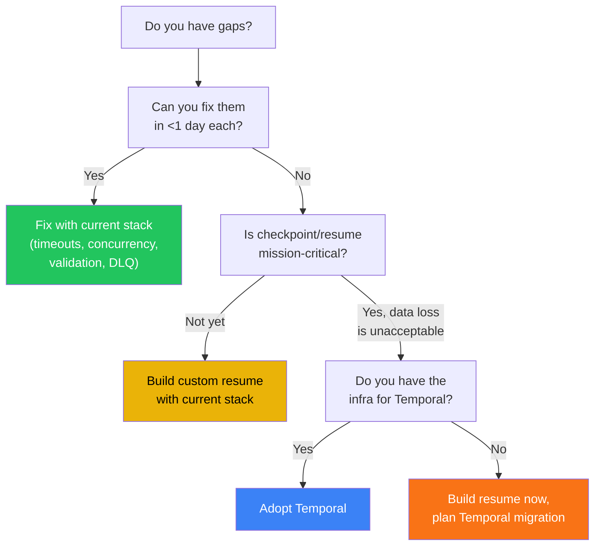

# Framework Analysis: Can We Fix the Gaps or Should We Switch?

> **Context:** The [Architecture Deep Dive](file:///c:/Users/Sourav%20Patil/Desktop/ASM/Orchestration%20Pipeline/orchestrator/docs/ORCHESTRATOR_ARCHITECTURE.md) identified gaps in edge cases, pipeline coupling, and missing metrics. This document evaluates whether our current stack (Prefect + custom Python) can address them, or whether switching to Temporal or Kestra is warranted.

---

## My Honest Assessment

**Short answer: You can solve ~80% of the gaps with your current stack and some custom code. The remaining 20% — durable execution, checkpoint/resume, and cancellation — is where Temporal genuinely shines. But switching has a real cost.**

The question isn't "can we build it?" (you always can), it's **"should we spend weeks building what a framework gives us in 2 lines?"**

---

## Gap-by-Gap Analysis

### Edge Cases We Don't Handle

#### 1. No Timeout Enforcement

| Approach | Implementation | Effort |
|----------|---------------|--------|
| **Prefect (current)** | Add `timeout_seconds` to `@task` and `@flow` decorators. Already a built-in Prefect feature — we're just not using it. | ✅ **5 minutes** — one-line change per decorator |
| **Temporal** | Built-in `start_to_close_timeout` per activity, `execution_timeout` per workflow | ✅ Built-in |
| **Kestra** | `timeout` property on each task | ✅ Built-in |

**Verdict: Fix with current stack.** Just add `timeout_seconds=3600` to our `@task` decorators.

```python
# Current (no timeout)
@task(name="bronze_to_silver", retries=3)

# Fixed (1 hour timeout)
@task(name="bronze_to_silver", retries=3, timeout_seconds=3600)
```

---

#### 2. No Concurrent Run Prevention

| Approach | Implementation | Effort |
|----------|---------------|--------|
| **Prefect (current)** | Use `ConcurrencyContext` tags or add a DB check in the flow (query `orchestration_runs` for `status='running'` with same `flow_name`) | 🟡 **~1 hour** |
| **Temporal** | Built-in `workflow_id_reuse_policy=REJECT_DUPLICATE`. One line. | ✅ Built-in |
| **Kestra** | Built-in `concurrency` limit on flows | ✅ Built-in |

**Verdict: Fix with current stack.** Add a guard at the start of each flow:

```python
# At the start of full_ingestion_flow:
existing = db.list_orchestration_runs(status="running", flow_name="full_ingestion")
if existing:
    raise RuntimeError(f"Flow already running: {existing[0]['id']}")
```

Or use Prefect's built-in:

```python
@flow(name="full_ingestion", concurrency_limit=1)
```

---

#### 3. No Partial Checkpoint / Resume ⚠️

This is the **most critical gap** and the one where framework choice matters most.

| Approach | Implementation | Effort |
|----------|---------------|--------|
| **Prefect (current)** | Custom resume logic: query completed `pipeline_runs` for the `orchestration_run_id`, skip completed layers | 🟡 **2-3 days** of careful work |
| **Temporal** | **Built-in.** Temporal workflows are event-sourced — if a worker crashes mid-Silver→Gold, it replays the event history and resumes from the exact point of failure. Variables, loop counters, everything is preserved. | ✅ Built-in, zero custom code |
| **Kestra** | Partial — can restart from failed task, but not as fine-grained as Temporal | 🟡 Partial |

**What "resume" looks like with current stack (custom build):**

```python
def full_ingestion_flow(..., resume_from_run_id: Optional[str] = None):
    if resume_from_run_id:
        # Find completed pipeline_runs for this orchestration run
        completed = db.list_pipeline_runs(
            orchestration_run_id=resume_from_run_id,
            status="completed"
        )
        completed_layers = {r["pipeline_name"] for r in completed}
    else:
        completed_layers = set()

    if "prebronze_to_bronze" not in completed_layers:
        run_prebronze_to_bronze(...)
    if "bronze_to_silver" not in completed_layers:
        run_bronze_to_silver(...)
    # etc.
```

**What "resume" looks like with Temporal:**

```python
# Nothing special — Temporal automatically replays the workflow
# from the event history if the worker crashes. You write the
# workflow as a normal function, and durability is free.
```

**Verdict: Solvable with current stack, but Temporal does it far better.** Our current approach tracks `current_layer`, so we have the data — we just need the resume logic. But Temporal's approach is fundamentally more robust because it preserves *all* state, not just which layer completed.

---

#### 4. No Input Validation

| Approach | Implementation | Effort |
|----------|---------------|--------|
| **Prefect (current)** | Add Pydantic validation in the flow before calling the pipeline task | ✅ **30 minutes** |
| **Temporal** | Same — you'd validate in the workflow before dispatching activities | Same effort |
| **Kestra** | JSON Schema validation on task inputs | Same effort |

**Verdict: Fix with current stack.** Framework-agnostic problem — every approach requires you to define the schema.

---

#### 5. No Dead-Letter Queue for Webhooks

| Approach | Implementation | Effort |
|----------|---------------|--------|
| **Prefect (current)** | Write failed webhook payloads to a `webhook_dead_letter` Supabase table. Add a retry API endpoint. | 🟡 **Half day** |
| **Temporal** | Built-in dead letter queue via `failure_exception_types` and `retry_policy` | ✅ Built-in |
| **Kestra** | Built-in dead letter handling with Kafka (Enterprise) | ✅ Built-in (Enterprise only) |

**Verdict: Fix with current stack.** Store failed payloads in Supabase and add a retry mechanism.

---

#### 6. No Resource Limits

| Approach | Implementation | Effort |
|----------|---------------|--------|
| **Prefect (current)** | Docker container resource limits (`--memory`, `--cpus`). Not an orchestration concern. | Infrastructure change |
| **Temporal** | Same — resource limits are on the activity worker containers | Infrastructure change |
| **Kestra** | Same — Docker runner resource limits | Infrastructure change |

**Verdict: All frameworks handle this the same way** — via container resource limits, not orchestration code. Deploy with `docker run --memory=4g`.

---

#### 7. No Cancellation Mechanism

| Approach | Implementation | Effort |
|----------|---------------|--------|
| **Prefect (current)** | Use Prefect's `cancel` API. Or add a `cancelled` check in each task that polls a flag in Supabase. | 🟡 **1 day** |
| **Temporal** | Built-in `workflow.cancel()`. Trigger cancellation from any client. Workflow receives a `CancelledError`. | ✅ Built-in |
| **Kestra** | Built-in kill/cancel from the UI or API | ✅ Built-in |

**Verdict: Solvable with current stack, but clunky.** Cancellation requires cooperative checking (polling a flag), which is fragile. Temporal's cancellation is fundamentally better because it propagates through the entire workflow tree.

---

### Changes That Require Orchestrator Updates (Pipeline Coupling)

| Problem | Prefect Fix | Temporal Fix | Kestra Fix |
|---------|------------|-------------|------------|
| **Pipeline renames entry function** | Write a wrapper interface/protocol that pipelines implement. If they change internally, the wrapper adapts. | Same — you'd define activity interfaces | Same — YAML task definitions still need updating |
| **Pipeline changes return dict keys** | Define a `PipelineResult` Pydantic model that pipelines must return. Validate on receipt. | Same — define result types | Same |
| **Pipeline adds new required params** | Version the pipeline contract. Use `**kwargs` for forward-compatible calls. | Same | Same |

**Verdict: Framework-agnostic.** The coupling problem is about **API contracts**, not orchestration. The solution is the same regardless of framework: define a formal interface (Pydantic model / Protocol class) that pipelines must conform to.

---

### What We Don't Collect (Missing Metrics)

| Missing Metric | Prefect Fix | Temporal Fix | Kestra Fix |
|----------------|------------|-------------|------------|
| **LangGraph tool durations** | Pipeline teams expose step metrics in their return dict. Wire to `StepLogger`. | Same — pipeline must report this | Same |
| **Memory/CPU usage** | `psutil` in the task wrapper, or Docker container metrics | Same | Kestra has built-in task duration/CPU metrics |
| **Table-level record counts** | Pipeline returns per-table breakdown in result dict | Same | Same |
| **LLM token usage** | Use LangChain callbacks (`OpenAICallbackHandler`) inside pipelines, return usage in result dict | Same | Same |
| **Data lineage** | Requires deep integration (OpenLineage, etc.) — major project regardless | Same | Kestra has OpenLineage plugin |

**Verdict: Mostly framework-agnostic.** The data must come from the pipeline itself. No framework magically knows your LangGraph tool timings or LLM token counts. The one exception is **Kestra's OpenLineage plugin** for data lineage, which is genuinely useful.

---

## Framework Comparison Matrix

| Capability | Current Stack (Prefect + Custom) | Temporal | Kestra |
|------------|----------------------------------|----------|--------|
| **Python-native** | ✅ 100% Python | ✅ Python SDK | ❌ YAML + some Python |
| **Durable execution** | ❌ Not built-in | ✅ Core feature — event-sourced | 🟡 Kafka-based (Enterprise) |
| **Checkpoint/resume** | 🟡 Custom build needed | ✅ Automatic — replay from event history | 🟡 Restart from failed task |
| **Timeout enforcement** | ✅ `@task(timeout_seconds=)` | ✅ Built-in | ✅ Built-in |
| **Concurrency limits** | ✅ Built-in tags | ✅ Built-in | ✅ Built-in |
| **Cancellation** | 🟡 Cooperative polling | ✅ Signal-based, propagates | ✅ Built-in |
| **Dead letter queue** | 🟡 Custom build | ✅ Built-in | ✅ Built-in (Enterprise) |
| **Observability UI** | ✅ Prefect Cloud or self-hosted | ✅ Temporal UI | ✅ Rich built-in UI |
| **Infrastructure cost** | Low — just Python process | 🟡 Temporal server (Cassandra or Postgres) + workers | 🟡 Kestra server + (optional) Kafka |
| **Learning curve** | ✅ Low — team already knows it | 🔴 High — new mental model (event sourcing, determinism constraints) | 🟡 Medium — YAML paradigm shift |
| **LangGraph compatibility** | ✅ Direct Python imports | ✅ Call as activities | 🟡 Wrap in script tasks |
| **Coolify deployment** | ✅ Simple Docker container | 🟡 Need Temporal server + worker containers | 🟡 Need Kestra server + executor |
| **Self-hosted** | ✅ No external services needed | 🟡 Temporal server (Java) + DB | ✅ Single binary or Docker |

---

## My Recommendation

### What To Do NOW (This Sprint — Current Stack)

These are **quick wins** that immediately improve reliability without any framework change:

```diff
# 1. Add timeouts (5 minutes of work)
- @task(name="bronze_to_silver", retries=3)
+ @task(name="bronze_to_silver", retries=3, timeout_seconds=3600)

# 2. Add concurrency guards (30 minutes)
+ existing = db.list_orchestration_runs(status="running", flow_name="full_ingestion")
+ if existing:
+     raise RuntimeError(f"Already running: {existing[0]['id']}")

# 3. Add input validation (30 minutes)
+ from pydantic import BaseModel, validator
+ class IngestionInput(BaseModel):
+     source_name: str
+     raw_input: List[Dict[str, Any]]
+     @validator("raw_input")
+     def non_empty(cls, v):
+         if not v: raise ValueError("raw_input cannot be empty")
+         return v

# 4. Add DLQ for webhooks (half day)
+ except Exception as exc:
+     db.create_webhook_dead_letter(payload=payload, error=str(exc))
```

### What To Do NEXT (Next Sprint — Still Current Stack)

Build the **resume capability** with custom code:

- Query completed `pipeline_runs` when restarting a flow
- Skip layers that already succeeded
- Add a `/api/retry/{run_id}` endpoint that calls the flow with `resume_from_run_id`
- Add success notifications (simple email/webhook after `status="completed"`)

### When To Consider Temporal (Future)

Switch to Temporal when any of these become true:

1. **You have >10 pipelines** and maintaining the wrapper boilerplate in `pipelines.py` becomes painful
2. **You need guaranteed exactly-once execution** (e.g., financial data, compliance-critical flows)
3. **Workflows become long-running** (hours/days) and crash-recovery from event history is essential
4. **You're building cross-service orchestration** beyond just data pipelines (e.g., orchestrating multiple microservices)
5. **The team grows** and you need multiple teams to define workflows independently

### Why NOT Temporal Right Now

1. **Infrastructure overhead**: Temporal requires a server (Java or Go binary) + Cassandra/Postgres + worker fleet. That's 3 more services on Coolify.
2. **Learning curve**: Temporal's determinism constraints (can't do I/O in workflows, only in activities) require a mental model shift. Your LangGraph pipelines would need restructuring.
3. **Overkill for 4 pipelines**: You have 4 data pipelines in a linear medallion chain. That's not complex enough to justify Temporal's complexity.
4. **You'd still need the same pipeline integration work**: Temporal doesn't magically know how to call your LangGraph pipelines — you'd still write wrappers.

### Why NOT Kestra

1. **YAML-first** breaks your Python-native workflow. Your team writes Python; Kestra would force context-switching.
2. **LangGraph integration is awkward** — you'd wrap Python pipelines in script tasks, losing type safety and debuggability.
3. **Enterprise features** (Kafka DLQ, advanced scheduling) require a paid license.

---

## Decision Framework



**For your current situation (4 pipelines, small team, deploying to Coolify), I recommend staying with the current stack and fixing the quick wins.** The gaps are all solvable with a few days of custom code. Temporal is the upgrade path when the system grows beyond what's comfortable to manage manually.

---

## Summary

| Gap | Fix Strategy | Effort | Framework Needed? |
|-----|--------------|--------|-------------------|
| Timeout enforcement | Add `timeout_seconds` to decorators | 5 min | ❌ Current stack |
| Concurrent run prevention | DB guard or Prefect concurrency limit | 30 min | ❌ Current stack |
| Input validation | Pydantic models | 30 min | ❌ Current stack |
| Webhook DLQ | Store failed payloads in Supabase | Half day | ❌ Current stack |
| Success notifications | Email/webhook after completion | Half day | ❌ Current stack |
| Schedule drift | Concurrency limit prevents overlap | 30 min | ❌ Current stack |
| Checkpoint/resume | Custom query+skip logic | 2-3 days | ❌ Current stack (Temporal is better) |
| Cancellation | Cooperative flag polling | 1 day | ❌ Current stack (Temporal is better) |
| Pipeline coupling | Pydantic interface contract | 1 day | ❌ Framework-agnostic |
| LangGraph tool metrics | Pipeline teams expose in result dict | Pipeline team work | ❌ Framework-agnostic |
| LLM token tracking | LangChain callbacks | Pipeline team work | ❌ Framework-agnostic |
| Data lineage | OpenLineage integration | Major project | 🟡 Kestra has plugin |
