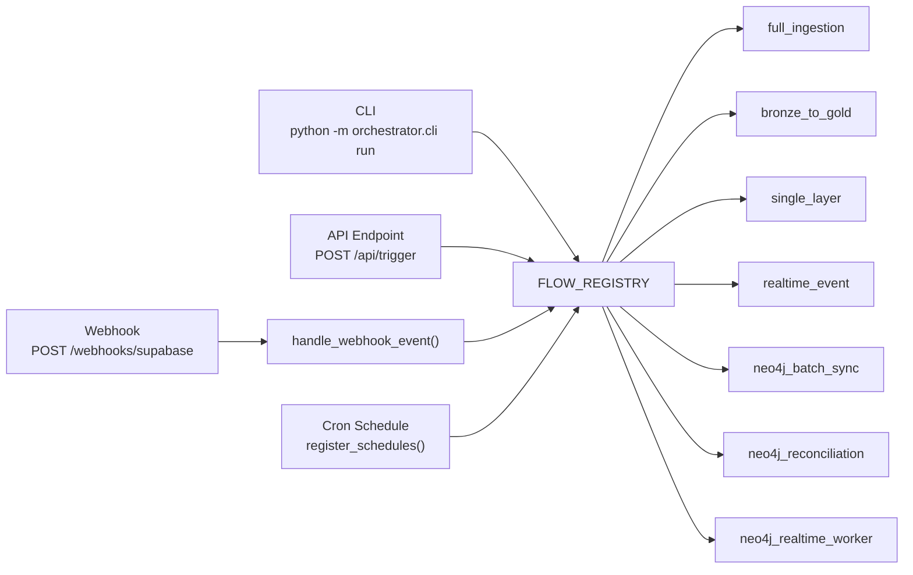
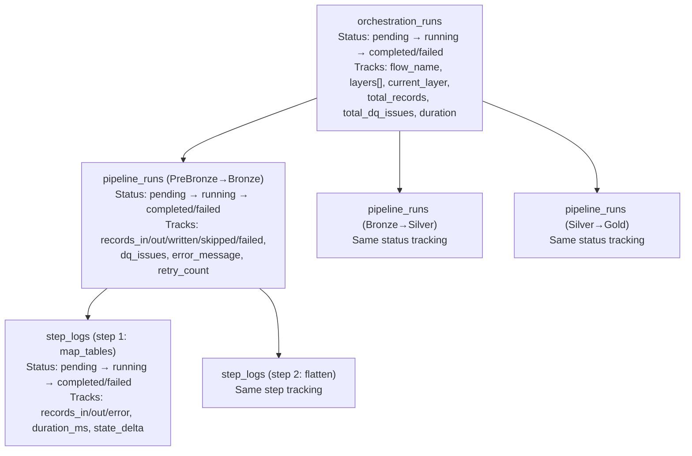
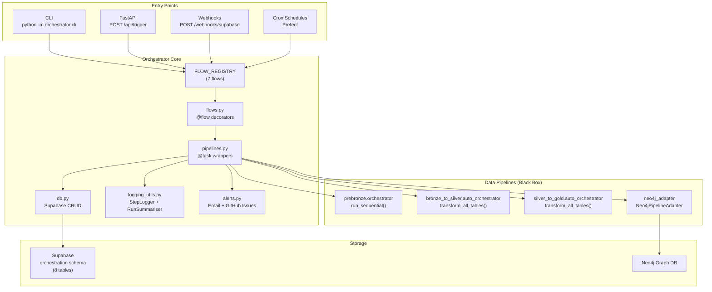

# Orchestrator Architecture — Deep Dive

> **Purpose:** Answers 7 key questions about how the orchestrator works, what it tracks, how it integrates with the data pipelines, and what gaps exist.

---

## 1. How Are Triggers Handled? How Will We Trigger Each Pipeline?

The orchestrator supports **4 trigger mechanisms**, all of which route to the same `FLOW_REGISTRY`:

### Trigger Mechanisms



### 1a. CLI Trigger (`cli.py → cmd_run`)
```bash
# Full end-to-end pipeline
python -m orchestrator.cli run --flow full_ingestion --source-name walmart --input data.csv

# Single layer only
python -m orchestrator.cli run --flow single_layer --layer bronze_to_silver

# Neo4j batch sync
python -m orchestrator.cli neo4j sync --layer all
```

The CLI's `cmd_run` function looks up the flow name in `FLOW_REGISTRY` and calls it directly. The `trigger_type` is set to `"manual"`.

**Source:** [cli.py](file:///c:/Users/Sourav%20Patil/Desktop/ASM/Orchestration%20Pipeline/orchestrator/orchestrator/cli.py#L57-L103)

### 1b. API Trigger (`api.py → POST /api/trigger`)
```json
POST /api/trigger
{
    "flow_name": "full_ingestion",
    "source_name": "walmart",
    "input_path": "/data/walmart_products.csv",
    "batch_size": 500
}
```

The API handler looks up `FLOW_REGISTRY[flow_name]`, builds kwargs based on the flow type, and calls the flow. The `trigger_type` is `"api"`.

**Source:** [api.py](file:///c:/Users/Sourav%20Patil/Desktop/ASM/Orchestration%20Pipeline/orchestrator/orchestrator/api.py#L100-L151)

### 1c. Webhook Trigger (`api.py → POST /webhooks/supabase`)

Supabase sends database webhook events (INSERT/UPDATE/DELETE) to the orchestrator. The handler in `triggers.py` does:

1. Maps Supabase event types (`insert` → `supabase_insert`)
2. Checks the `event_triggers` table for matching rules
3. If a match is found → dispatches to the trigger's configured `flow_name`
4. If no match → uses **default routing**:
   - Gold schema events → `neo4j_batch_sync_flow`
   - Everything else → `realtime_event_flow`

**Source:** [triggers.py](file:///c:/Users/Sourav%20Patil/Desktop/ASM/Orchestration%20Pipeline/orchestrator/orchestrator/triggers.py#L82-L185)

### 1d. Cron Schedule Trigger (`triggers.py → register_schedules`)

Reads `schedule_definitions` from the orchestration schema and registers them as Prefect cron deployments. Pre-seeded schedules include:

| Schedule | Cron | Flow |
|----------|------|------|
| `daily_full_ingestion` | `0 2 * * *` (2 AM daily) | `full_ingestion` |
| `weekly_usda_nutrition` | `0 3 * * 0` (3 AM Sunday) | `full_ingestion` |
| `hourly_neo4j_sync` | `0 * * * *` (every hour) | `neo4j_batch_sync` |
| `daily_reconciliation` | `30 3 * * *` (3:30 AM daily) | `neo4j_reconciliation` |

**Source:** [triggers.py](file:///c:/Users/Sourav%20Patil/Desktop/ASM/Orchestration%20Pipeline/orchestrator/orchestrator/triggers.py#L22-L75)

---

## 2. Are We Engaging With the Data Pipelines' Code? What About New Agent Tools?

### How We Engage

The orchestrator treats each pipeline as a **black box**. It calls exactly one or two entry-point functions per pipeline and reads the returned dict:

| Pipeline | Import Path | Function Called | What We Send | What We Read Back |
|----------|-------------|-----------------|--------------|-------------------|
| PreBronze→Bronze | `prebronze.orchestrator` | `run_sequential(state)` | `source_name`, `raw_input`, `ingestion_run_id` | `records_loaded`, `validation_errors_count`, `validation_errors` |
| Bronze→Silver | `bronze_to_silver.auto_orchestrator` | `transform_all_tables()` | Nothing (auto-discovers tables) | `total_processed`, `total_written`, `total_failed`, `total_dq_issues` |
| Silver→Gold | `silver_to_gold.auto_orchestrator` | `transform_all_tables()` | Nothing (auto-discovers tables) | `total_processed`, `total_written`, `total_failed` |
| Gold→Neo4j | `orchestrator.neo4j_adapter` | `Neo4jPipelineAdapter.run_all_layers()` | `layer` param | `status`, `total_rows_fetched`, `total_duration_ms`, `error` |

### What Happens If They Add New Agent Tools?

> [!WARNING]
> **The orchestrator does NOT introspect LangGraph tools.** It calls the top-level function (`run_sequential` or `transform_all_tables`) and reads the summary dict. Internal LangGraph tool additions are invisible to us.

**This means:**

- ✅ **No orchestrator changes needed** if a pipeline team adds new tools internally (e.g., a new `validate_nutrition` tool in Bronze→Silver). The tool runs inside the LangGraph graph, and `transform_all_tables()` still returns the same summary dict.

- ⚠️ **Orchestrator changes ARE needed** if:
  1. The new tool **changes the return dict keys** (e.g., adds `total_nutrition_enriched` that we should track)
  2. The new tool **requires new input parameters** that the orchestrator doesn't currently pass
  3. The pipeline team **renames the entry-point function** or moves it to a different module

### The Key Limitation

The orchestrator currently **does not log individual LangGraph tool steps**. The `StepLogger` class exists and is capable of step-level logging, but the pipeline wrappers in `pipelines.py` **do not use it** — they only log at the pipeline level (start/end/metrics).

To get step-level visibility, the pipeline wrappers would need to either:
1. Wrap each LangGraph tool call in a `StepLogger.step()` context
2. Or the pipeline itself would need to report step-level metrics in its return dict

**Source:** [pipelines.py](file:///c:/Users/Sourav%20Patil/Desktop/ASM/Orchestration%20Pipeline/orchestrator/orchestrator/pipelines.py#L73-L170)

---

## 3. What Edge Cases Are Covered? What's Missing?

### ✅ Edge Cases We DO Handle

| Edge Case | How We Handle It | Where |
|-----------|-----------------|-------|
| **Pipeline crashes mid-execution** | `try/except` wraps every pipeline call. Sets `status=failed`, logs error message + full traceback | `pipelines.py` — every wrapper |
| **Neo4j sync failure in full_ingestion** | Inner `try/except` — marked as non-fatal. The overall ingestion still succeeds | `flows.py` lines 128-141 |
| **Malformed webhook payload** | Returns `{"error": "Malformed payload", "skipped": True}` | `triggers.py` line 110 |
| **Unknown flow name in API trigger** | Returns HTTP 400 with list of available flows | `api.py` lines 117-122 |
| **Unknown flow name in schedule** | Logs warning and skips registration | `triggers.py` lines 51-55 |
| **Webhook secret verification** | Validates `x-webhook-secret` header if configured | `api.py` lines 76-78 |
| **Missing input data** | `full_ingestion` defaults `raw_input=[]` if both `raw_input` and `input_path` are None | `flows.py` lines 72-75 |
| **Prefect not installed** | `register_schedules()` catches `ImportError` and logs error | `triggers.py` lines 31-33 |
| **Pipeline directory not found** | `_ensure_pipeline_on_path()` logs warning but doesn't crash | `pipelines.py` line 61 |
| **Auto-retries on failure** | Prefect `@task(retries=3)` retries failed pipeline tasks | `pipelines.py` — `@task` decorators |
| **Alert deduplication** | `AlertDispatcher` supports `dedup_key` + `dedup_window_seconds` (300s default) | `alerts.py` lines 232-234 |
| **Alert channel failure** | Alert dispatch is wrapped in `try/except` (best-effort) | `pipelines.py` — alert calls in `except` blocks |

### ❌ Edge Cases We Do NOT Handle

| Missing Edge Case | Risk Level | Description |
|-------------------|------------|-------------|
| **No timeout enforcement** | 🔴 High | If a pipeline hangs indefinitely, there's no timeout. The orchestration run stays `running` forever. We track `timed_out` as a status but never set it. |
| **No concurrent run prevention** | 🔴 High | Nothing prevents two `full_ingestion` flows from running simultaneously on the same source data, causing duplicate writes. |
| **No partial checkpoint / resume** | 🟡 Medium | If Silver→Gold fails after Bronze→Silver succeeded, re-running `full_ingestion` re-runs ALL layers from scratch instead of resuming from the last completed layer. |
| **No input validation for pipeline data** | 🟡 Medium | `raw_input` is passed directly to the pipeline with no schema validation. Malformed data crashes inside the LangGraph graph with unhelpful errors. |
| **No dead-letter queue for webhooks** | 🟡 Medium | If a webhook triggers a flow that crashes, the event is lost. There's no retry mechanism for failed webhook events. |
| **No resource limits** | 🟡 Medium | No memory/CPU limits on pipeline execution. A pipeline that loads a massive DataFrame can OOM the server. |
| **No cancellation mechanism** | 🟢 Low | There's no API to cancel a running flow. The `cancelled` status exists but nothing sets it. |
| **No notification on success** | 🟢 Low | Alerts only fire on failure/critical errors. There's no option to notify on successful completion. |
| **Schedule drift detection** | 🟢 Low | If a scheduled run takes longer than its interval (e.g., hourly sync takes 2 hours), the next run starts before the previous one finishes. |

---

## 4. If Data Pipelines Change Their Code, Do We Need to Change Ours?

### Changes That Require NO Orchestrator Updates

| Pipeline Change | Why It's Safe |
|-----------------|---------------|
| Add/remove internal LangGraph tools | We only call the top-level function |
| Change internal processing logic | Same entry point, same return dict |
| Add new tables to auto-discovery | `transform_all_tables()` auto-discovers; we don't specify tables |
| Change LLM model or prompts | Internal to the pipeline |
| Add internal logging or error handling | Doesn't affect the return dict |
| Add new optional keys to the return dict | We read with `.get()` which defaults to 0 |

### Changes That REQUIRE Orchestrator Updates

| Pipeline Change | What We Need to Update | Severity |
|-----------------|----------------------|----------|
| **Rename the entry-point function** (e.g., `run_sequential` → `run_pipeline`) | Update `from X import Y` in `pipelines.py` | 🔴 Breaking |
| **Move the function to a different module** (e.g., `prebronze.orchestrator` → `prebronze.runner`) | Update import path in `pipelines.py` | 🔴 Breaking |
| **Change function signature** (e.g., require a new mandatory parameter) | Update the call site in `pipelines.py` | 🔴 Breaking |
| **Remove/rename return dict keys** (e.g., `records_loaded` → `rows_written`) | Update metric extraction in `pipelines.py` | 🟡 Silent data loss |
| **Change package directory name** (e.g., `prebronze/` → `ingestion/`) | Update `_ensure_pipeline_on_path()` glob pattern and import | 🟡 Import failure |
| **Add new return dict keys that we want to track** (e.g., `nutrition_enriched_count`) | Add metric extraction in `pipelines.py` + new DB column | 🟢 Optional enhancement |

### Summary

**The vast majority of pipeline code changes are safe.** The risk is limited to the narrow API contract: the function name, the import path, and the return dict keys. See the "Public API Contract" section in the [Packaging Strategy document](file:///c:/Users/Sourav%20Patil/Desktop/ASM/Orchestration%20Pipeline/orchestrator/docs/PIPELINE_PACKAGING_STRATEGY.md) for the exact contract.

---

## 5. Checkpoints, Markers, and Status Codes

### Three-Level Status Tracking

The orchestrator tracks state at **3 hierarchical levels**, all persisted in the `orchestration` schema:



### Status Codes (Defined in `models.py`)

**Orchestration Run / Pipeline Run statuses:**

| Status | Meaning |
|--------|---------|
| `pending` | Created but not started |
| `queued` | Waiting in Prefect queue |
| `running` | Currently executing |
| `completed` | Finished successfully |
| `failed` | Finished with an error |
| `partially_completed` | Some layers succeeded, others failed |
| `cancelled` | Manually cancelled (not yet implemented) |
| `timed_out` | Exceeded time limit (not yet implemented) |
| `retrying` | Retrying after failure |
| `skipped` | Skipped (e.g., no data to process) |

**Step Log statuses:**

| Status | Meaning |
|--------|---------|
| `pending` | Not started |
| `running` | Currently executing |
| `completed` | Finished |
| `failed` | Error occurred |
| `skipped` | Skipped |

### What Gets Tracked as "Checkpoints"

| Checkpoint Type | Where Stored | When Written |
|-----------------|-------------|--------------|
| **Current layer** | `orchestration_runs.current_layer` | Updated before each pipeline starts (e.g., `"bronze_to_silver"`) |
| **Pipeline run status** | `pipeline_runs.status` | `pending` on creation → `completed`/`failed` when done |
| **Error details** | `pipeline_runs.error_message` + `error_details` (JSONB with full traceback) | Written on failure |
| **Step results** | `pipeline_step_logs` | Written per-tool if `StepLogger` is used |
| **DQ summaries** | `run_dq_summary` | Written after pipeline completion via `RunSummariser` |
| **Alerts** | `alert_log` | Written on critical failures |

### What's Missing: True Resume Capability

> [!IMPORTANT]
> The `current_layer` field tells you *where* a run was when it failed, but the orchestrator **cannot resume from that layer**. A re-run always starts from the beginning of the flow. True checkpoint-resume would require reading the completed pipeline_runs for an orchestration_run and skipping already-completed layers.

---

## 6. What Details Do We Get From Every Pipeline?

### Data Collected Per Pipeline

#### PreBronze → Bronze
```python
# From the return dict of run_sequential()
records_loaded: int        # → pipeline_runs.records_written
validation_errors_count: int  # → pipeline_runs.records_failed
validation_errors: list    # → pipeline_runs.dq_issues_found (count)
```

#### Bronze → Silver
```python
# From the return dict of transform_all_tables()
total_processed: int    # → pipeline_runs.records_input + records_processed
total_written: int      # → pipeline_runs.records_written
total_failed: int       # → pipeline_runs.records_failed
total_dq_issues: int    # → pipeline_runs.dq_issues_found
```

#### Silver → Gold
```python
# From the return dict of transform_all_tables()
total_processed: int    # → pipeline_runs.records_input + records_processed
total_written: int      # → pipeline_runs.records_written
total_failed: int       # → pipeline_runs.records_failed
# Note: no dq_issues tracked for this layer
```

#### Gold → Neo4j (Batch Sync)
```python
# From Neo4jPipelineAdapter result object
status: str                # → "completed" or "failed"
total_rows_fetched: int    # → pipeline_runs.records_processed + records_written
total_duration_ms: int     # → converted to seconds
error: str | None          # → pipeline_runs.error_message
```

### Aggregated at Orchestration Run Level

| Field | Description | Aggregation |
|-------|-------------|-------------|
| `total_records_written` | Sum of all `records_written` across all pipeline_runs | Incremental sum |
| `total_dq_issues` | Sum of all `dq_issues_found` across pipeline_runs | Incremental sum |
| `total_errors` | Count of pipeline_runs that failed | Incremented on failure |
| `duration_seconds` | Wall-clock time from start to completion | `time.time() - start` |
| `current_layer` | Which pipeline is currently executing | Updated before each layer |

### What We Don't Collect

| Missing Metric | Why It Matters |
|----------------|----------------|
| **Individual LangGraph tool durations** | Can't identify which tool is the bottleneck |
| **Memory/CPU usage** | Can't detect resource-hungry pipelines |
| **Table-level record counts** | Only get totals, not per-table breakdown |
| **LLM token usage / cost** | Can't track AI cost per pipeline run |
| **Data lineage graph** | No tracking of which source records produced which output records |

---

## 7. Adding a New Pipeline — What Changes Are Required?

### Required Changes (5 files)

Adding a new pipeline (e.g., `gold_to_analytics`) requires changes in **exactly 5 files**:

---

#### 1. `orchestration_schema.sql` — Register the Pipeline Definition

```sql
INSERT INTO orchestration.pipeline_definitions (pipeline_name, layer_from, layer_to, description)
VALUES ('gold_to_analytics', 'gold', 'analytics',
        'Export Gold data to analytics warehouse')
ON CONFLICT (pipeline_name) DO NOTHING;
```

> [!NOTE]
> The `layer_from` / `layer_to` constraints currently only allow `prebronze`, `bronze`, `silver`, `gold`, `neo4j`. Adding a new layer like `analytics` requires updating the CHECK constraint first.

---

#### 2. `pipelines.py` — Add a New Task Wrapper

```python
@task(
    name="gold_to_analytics",
    retries=settings.orchestrator_max_retries,
    retry_delay_seconds=settings.orchestrator_retry_delay_seconds,
    log_prints=True,
)
def run_gold_to_analytics(
    orchestration_run_id: str,
    trigger_type: str = "manual",
    triggered_by: Optional[str] = None,
    config: Optional[Dict[str, Any]] = None,
) -> Dict[str, Any]:
    cfg = config or {}
    start = time.time()

    pipeline_run = db.create_pipeline_run(
        pipeline_name="gold_to_analytics",
        orchestration_run_id=orchestration_run_id,
        trigger_type=trigger_type,
        triggered_by=triggered_by,
        run_config=cfg,
    )
    run_id = pipeline_run["id"]

    try:
        # Import your pipeline's entry point
        from analytics_pipeline import export_to_warehouse  # adapt as needed

        result = export_to_warehouse(**cfg)

        db.update_pipeline_run(
            run_id,
            status="completed",
            records_written=result.get("records_exported", 0),
            completed_at=db._utcnow(),
            duration_seconds=_calculate_duration(start),
        )
        return result

    except Exception as exc:
        db.update_pipeline_run(
            run_id,
            status="failed",
            completed_at=db._utcnow(),
            duration_seconds=_calculate_duration(start),
            error_message=str(exc),
            error_details={"traceback": traceback.format_exc()},
        )
        raise
```

---

#### 3. `flows.py` — Add a New Flow (if needed) and Register It

```python
@flow(name="gold_to_analytics", log_prints=True)
def gold_to_analytics_flow(
    trigger_type: str = "manual",
    triggered_by: Optional[str] = None,
    config: Optional[Dict[str, Any]] = None,
) -> Dict[str, Any]:
    # Create orchestration run and call the pipeline task
    ...

# Add to FLOW_REGISTRY
FLOW_REGISTRY = {
    ...
    "gold_to_analytics": gold_to_analytics_flow,  # ← NEW
}
```

---

#### 4. `flows.py` → `LAYER_TASKS` dict — If Your Pipeline Is a Layer

```python
LAYER_TASKS = {
    "prebronze_to_bronze": run_prebronze_to_bronze,
    "bronze_to_silver": run_bronze_to_silver,
    "silver_to_gold": run_silver_to_gold,
    "gold_to_analytics": run_gold_to_analytics,  # ← NEW
}
```

This allows triggering via `single_layer_flow(layer="gold_to_analytics")`.

---

#### 5. `models.py` — Update Enums (if new layer)

If your new layer introduces a new `layer_from` or `layer_to` value, update the schema CHECK constraints and any code that validates layer names.

---

### Optional Changes

| File | Change | When Needed |
|------|--------|-------------|
| `schedule_definitions` (SQL) | Add a cron schedule | If the new pipeline should run on a schedule |
| `event_triggers` (SQL) | Add a trigger rule | If database events should trigger the pipeline |
| `api.py` | Add flow-specific API params | If the new flow needs custom API input handling |
| Dashboard pages | Add new pipeline stats | To visualize the new pipeline in the dashboard |

### Summary

Adding a new pipeline follows a **predictable pattern**: write a `@task` wrapper, create a `@flow`, register it in `FLOW_REGISTRY`, and seed the pipeline definition in the schema. The pattern is identical across all existing pipelines, making it straightforward to replicate.

---

## Architecture Summary


