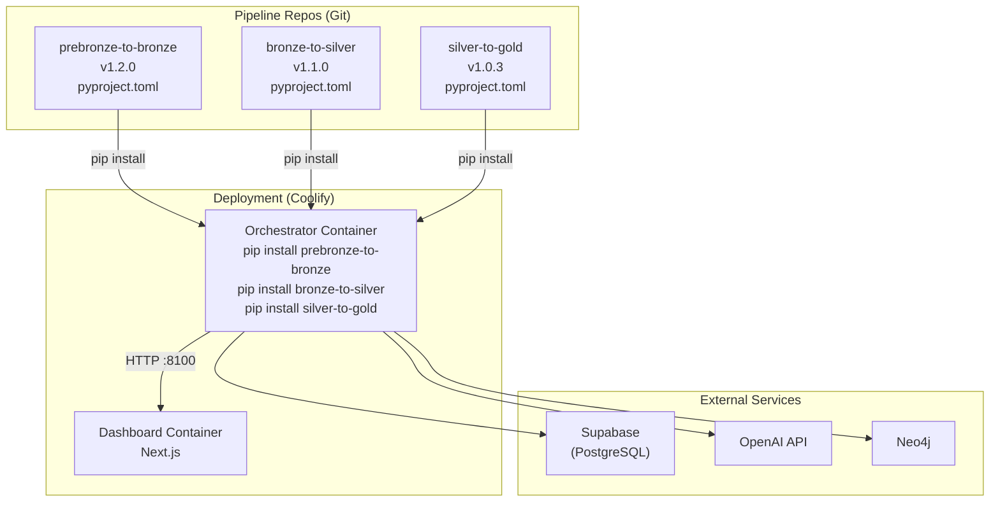

# Pipeline Packaging Strategy: Installable Python Packages

> **Document for:** Pipeline development teams (PreBronze→Bronze, Bronze→Silver, Silver→Gold, Gold→Neo4j)
> **Purpose:** Enable the orchestrator to import your pipeline as a standard Python package instead of relying on filesystem path hacking

---

## Why We Need This

### The Current Problem

Today, the orchestrator finds your pipeline code by scanning sibling directories on the filesystem:

```
Orchestration Pipeline/
├── orchestrator/              ← scans parent directory at runtime
├── prebronze-to-bronze 1/     ← found via glob("prebronze-to-bronze*")
├── bronze-to-silver 1/        ← found via glob("bronze-to-silver*")
├── silver-to-gold 1/          ← found via glob("silver-to-gold*")
└── Gold-to-Neo4j_with_agentic_checks/
```

The orchestrator uses this function to discover your code:

```python
def _ensure_pipeline_on_path(pipeline_dir_name: str):
    base = Path(__file__).resolve().parent.parent.parent
    candidates = sorted(base.glob(f"{pipeline_dir_name}*"))
    for candidate in candidates:
        inner_dirs = sorted(candidate.glob("*/"))
        for inner in inner_dirs:
            if inner.is_dir() and not inner.name.startswith("."):
                sys.path.insert(0, str(inner))
                return
```

This approach has **critical limitations**:

| Problem | Impact |
|---------|--------|
| **Cannot deploy to containers** | Docker/Coolify builds don't have sibling directories — each service is its own container |
| **No version pinning** | The orchestrator always uses whatever code is on disk — no way to pin `bronze-to-silver==1.2.3` |
| **Fragile path discovery** | Directory names with spaces, numbers, or renamed folders break the glob pattern |
| **No dependency resolution** | `pip` cannot verify that pipeline dependencies are compatible with each other |
| **No reproducible builds** | Two developers with slightly different directory layouts get different behavior |
| **Impossible to test in CI** | GitHub Actions / CI runners won't have the same directory structure |

### The Solution: Installable Python Packages

By adding a single `pyproject.toml` file to each pipeline repo, they become standard Python packages that can be:
- **Installed** via `pip install` (locally, from git, or from a registry)
- **Versioned** with semantic versioning
- **Tested** independently in CI
- **Deployed** into any Docker container

The orchestrator import changes from:
```python
# ❌ Before: fragile filesystem hack
_ensure_pipeline_on_path("prebronze-to-bronze")
from prebronze.orchestrator import run_sequential
```
to:
```python
# ✅ After: standard Python import (works everywhere)
from prebronze.orchestrator import run_sequential
```

---

## What Each Pipeline Team Needs to Do

### Step 1: Add `pyproject.toml` to Your Repo Root

This is the **only required change**. It tells Python how to install your code as a package.

Below are the exact files for each pipeline:

---

#### PreBronze → Bronze

**File:** `prebronze-to-bronze/pyproject.toml`

```toml
[build-system]
requires = ["hatchling"]
build-backend = "hatchling.build"

[project]
name = "prebronze-to-bronze"
version = "1.0.0"
description = "Agentic ingestion pipeline: CSV/JSON → Bronze tables via LangGraph"
requires-python = ">=3.11"
dependencies = [
    "langchain>=0.1.0",
    "langchain-openai>=0.1.0",
    "langgraph>=0.0.26",
    "pandas>=2.1.0",
    "pyyaml>=6.0",
    "langdetect>=1.0.9",
    "tqdm>=4.66.0",
    "python-dotenv>=1.0.0",
    "supabase>=2.0.3",
]

[project.optional-dependencies]
dev = [
    "pytest>=7.4.0",
    "pytest-cov>=4.1.0",
    "ruff>=0.1.0",
]

[tool.hatch.build.targets.wheel]
# Tell hatch where the importable package lives
packages = ["prebronze"]
```

> [!IMPORTANT]
> The `packages = ["prebronze"]` line under `[tool.hatch.build.targets.wheel]` must point to the **directory name** that contains your Python modules — the one with `__init__.py`. This is the name used in `import prebronze`.

**What the orchestrator imports from your package:**
```python
from prebronze.orchestrator import run_sequential
from prebronze.state import OrchestratorState
```

Make sure these modules exist and are importable after installation.

---

#### Bronze → Silver

**File:** `bronze-to-silver/pyproject.toml`

```toml
[build-system]
requires = ["hatchling"]
build-backend = "hatchling.build"

[project]
name = "bronze-to-silver"
version = "1.0.0"
description = "Agentic transformation pipeline: Bronze → Silver via LangGraph"
requires-python = ">=3.11"
dependencies = [
    "langchain>=0.1.0",
    "langchain-openai>=0.1.0",
    "langgraph>=0.0.26",
    "pandas>=2.1.0",
    "pyyaml>=6.0",
    "langdetect>=1.0.9",
    "tqdm>=4.66.0",
    "python-dotenv>=1.0.0",
    "supabase>=2.0.3",
    "requests>=2.31.0",
]

[project.optional-dependencies]
dev = [
    "pytest>=7.4.0",
    "pytest-cov>=4.1.0",
    "ruff>=0.1.0",
]

[tool.hatch.build.targets.wheel]
packages = ["bronze_to_silver"]
```

**What the orchestrator imports from your package:**
```python
from bronze_to_silver.auto_orchestrator import transform_all_tables
```

---

#### Silver → Gold

**File:** `silver-to-gold/pyproject.toml`

```toml
[build-system]
requires = ["hatchling"]
build-backend = "hatchling.build"

[project]
name = "silver-to-gold"
version = "1.0.0"
description = "Agentic enrichment pipeline: Silver → Gold via LangGraph"
requires-python = ">=3.11"
dependencies = [
    "langchain>=0.1.0",
    "langchain-openai>=0.1.0",
    "langgraph>=0.0.26",
    "pandas>=2.1.0",
    "pyyaml>=6.0",
    "python-dotenv>=1.0.0",
    "supabase>=2.0.3",
]

[project.optional-dependencies]
dev = [
    "pytest>=7.4.0",
    "pytest-cov>=4.1.0",
    "ruff>=0.1.0",
]

[tool.hatch.build.targets.wheel]
packages = ["silver_to_gold"]
```

**What the orchestrator imports from your package:**
```python
from silver_to_gold.auto_orchestrator import transform_all_tables
```

---

#### Gold → Neo4j

The Gold→Neo4j pipeline is handled differently — its adapter (`neo4j_adapter.py`) lives inside the orchestrator package and references the pipeline via the `NEO4J_PIPELINE_DIR` config setting. No `pyproject.toml` is needed unless the team wants to decouple it further.

---

### Step 2: Verify Your Package Structure

Each pipeline repo should have this structure after adding `pyproject.toml`:

```
your-pipeline-repo/
├── pyproject.toml              ← NEW (the only new file)
├── requirements.txt            ← keep for backward compatibility
├── Dockerfile                  ← existing
├── README.md                   ← existing
├── your_package_name/          ← must match [tool.hatch.build.targets.wheel] packages
│   ├── __init__.py             ← REQUIRED (can be empty)
│   ├── auto_orchestrator.py    ← or whatever modules you expose
│   ├── ...
│   └── other_modules.py
└── tests/                      ← optional but recommended
    └── ...
```

> [!CAUTION]
> **Critical:** Your importable package directory **must** have an `__init__.py` file. Without it, Python won't recognize it as a package and imports will fail. If it doesn't exist, create an empty one:
> ```bash
> touch your_package_name/__init__.py
> ```

### Step 3: Test Locally

After adding `pyproject.toml`, verify it works:

```bash
# From your pipeline repo root
cd prebronze-to-bronze/   # or bronze-to-silver/, silver-to-gold/

# Install in editable mode (changes take effect immediately)
pip install -e .

# Verify the import works
python -c "from prebronze.orchestrator import run_sequential; print('✅ Import works')"
```

If the import fails, check:
1. Does the package directory name match what's in `packages = [...]`?
2. Does the package directory have `__init__.py`?
3. Are all dependencies listed in `pyproject.toml`?

---

## How the Orchestrator Will Use Your Packages

### During Local Development

Developers clone all repos side by side and install them in editable mode:

```bash
# One-time setup
cd "Orchestration Pipeline"
pip install -e "./prebronze-to-bronze 1/prebronze-to-bronze"
pip install -e "./bronze-to-silver 1/bronze-to-silver"
pip install -e "./silver-to-gold 1/silver-to-gold"
pip install -e "./orchestrator"
```

With editable installs, any code changes in your pipeline repo are **immediately visible** to the orchestrator — no reinstall needed.

### During Docker / Coolify Deployment

The orchestrator's Dockerfile will install your pipelines from **git URLs** (or a private package registry):

```dockerfile
FROM python:3.12-slim

# Install pipeline packages from git
RUN pip install \
    "prebronze-to-bronze @ git+https://github.com/your-org/prebronze-to-bronze.git@v1.0.0" \
    "bronze-to-silver @ git+https://github.com/your-org/bronze-to-silver.git@v1.0.0" \
    "silver-to-gold @ git+https://github.com/your-org/silver-to-gold.git@v1.0.0"

# Install the orchestrator itself
COPY orchestrator/ /app/orchestrator/
RUN pip install /app/orchestrator

CMD ["uvicorn", "orchestrator.api:app", "--host", "0.0.0.0", "--port", "8100"]
```

### In CI/CD Pipelines

Each pipeline repo can run its own tests independently:

```yaml
# .github/workflows/test.yml (in each pipeline repo)
name: Test Pipeline
on: [push, pull_request]
jobs:
  test:
    runs-on: ubuntu-latest
    steps:
      - uses: actions/checkout@v4
      - uses: actions/setup-python@v5
        with:
          python-version: "3.12"
      - run: pip install -e ".[dev]"
      - run: pytest
```

---

## Versioning Strategy

### Semantic Versioning (SemVer)

Each pipeline should follow semantic versioning: **`MAJOR.MINOR.PATCH`**

| Change Type | Version Bump | Example | When |
|-------------|-------------|---------|------|
| Breaking API change | MAJOR | `1.0.0` → `2.0.0` | Changed function signatures, removed modules, renamed exports |
| New feature, backward compatible | MINOR | `1.0.0` → `1.1.0` | Added new functions, new optional parameters |
| Bug fix | PATCH | `1.0.0` → `1.0.1` | Fixed a bug, no API changes |

### How to Bump Versions

Edit `version` in `pyproject.toml`:

```toml
[project]
version = "1.1.0"  # ← bump this
```

Then tag the release in git:

```bash
git add pyproject.toml
git commit -m "release: v1.1.0 — add batch processing support"
git tag v1.1.0
git push origin main --tags
```

### Version Pinning in the Orchestrator

The orchestrator will pin pipeline versions to ensure stability:

```toml
# orchestrator/pyproject.toml
[project.optional-dependencies]
pipelines = [
    "prebronze-to-bronze>=1.0.0,<2.0.0",   # compatible with any 1.x
    "bronze-to-silver>=1.0.0,<2.0.0",
    "silver-to-gold>=1.0.0,<2.0.0",
]
```

Or for exact pinning in production:
```toml
pipelines = [
    "prebronze-to-bronze==1.2.3",
    "bronze-to-silver==1.1.0",
    "silver-to-gold==1.0.5",
]
```

---

## The Public API Contract

Each pipeline must expose specific functions that the orchestrator calls. These are your **public API** — changing them is a **breaking change** (MAJOR version bump).

### Required Exports

| Pipeline | Module Path | Function | Signature |
|----------|-------------|----------|-----------|
| PreBronze→Bronze | `prebronze.orchestrator` | `run_sequential` | `(state: dict) → dict` |
| PreBronze→Bronze | `prebronze.state` | `OrchestratorState` | TypedDict / dataclass |
| Bronze→Silver | `bronze_to_silver.auto_orchestrator` | `transform_all_tables` | `() → dict` |
| Silver→Gold | `silver_to_gold.auto_orchestrator` | `transform_all_tables` | `() → dict` |

### Return Value Contract

The orchestrator reads specific keys from the return dict. Your function **must** include these:

**PreBronze→Bronze** `run_sequential()` must return:
```python
{
    "records_loaded": int,           # number of records written to bronze
    "validation_errors_count": int,  # number of records that failed validation
    "validation_errors": list,       # list of error details
}
```

**Bronze→Silver / Silver→Gold** `transform_all_tables()` must return:
```python
{
    "total_processed": int,     # total records processed
    "total_written": int,       # total records written
    "total_failed": int,        # total records that failed
    "total_dq_issues": int,     # data quality issues found (bronze→silver only)
}
```

> [!WARNING]
> **Do not rename or remove these keys** without coordinating with the orchestrator team. Adding new keys is always safe (MINOR version bump). Removing or renaming keys is a breaking change (MAJOR version bump).

---

## Environment Variables

Your pipeline currently reads environment variables (e.g., `SUPABASE_URL`, `OPENAI_API_KEY`) via `python-dotenv` and `.env` files. When running under the orchestrator, these variables are set by the **orchestrator's `.env`** file, not yours.

### What This Means for You

1. **Keep using `os.environ` / `python-dotenv`** — no code change needed
2. **Do NOT hardcode credentials** in your package code
3. **Document all required env vars** in your `README.md`
4. The orchestrator's deployment will set all env vars via Coolify's environment configuration

### Required Environment Variables (Per Pipeline)

Document these in your README so the orchestrator team knows what to configure:

| Variable | Used By | Description |
|----------|---------|-------------|
| `SUPABASE_URL` | All pipelines | Supabase project URL |
| `SUPABASE_SERVICE_ROLE_KEY` | All pipelines | Service role key for DB access |
| `OPENAI_API_KEY` | All pipelines | OpenAI API key for LLM steps |
| `OPENAI_MODEL_NAME` | All pipelines | Model to use (default: `gpt-4o-mini`) |

---

## Migration Checklist

Use this checklist when converting your pipeline to an installable package:

### Pipeline Team Checklist

- [ ] Add `pyproject.toml` to repo root (use templates above)
- [ ] Verify `__init__.py` exists in your main package directory
- [ ] Verify `packages = ["your_package"]` matches your directory name
- [ ] Copy dependencies from `requirements.txt` into `pyproject.toml` `dependencies`
- [ ] Test: `pip install -e .` succeeds without errors
- [ ] Test: The orchestrator's expected imports work (see "Required Exports" table)
- [ ] Test: `pip install .` (non-editable) also works
- [ ] Tag release: `git tag v1.0.0 && git push --tags`
- [ ] Document all required environment variables in `README.md`
- [ ] Keep `requirements.txt` for backward compatibility (it can stay)

### Orchestrator Team Checklist (After All Pipelines Are Packaged)

- [ ] Remove `_ensure_pipeline_on_path()` function from `pipelines.py`
- [ ] Remove all `_ensure_pipeline_on_path(...)` calls before imports
- [ ] Add pipeline packages to orchestrator's `pyproject.toml` as dependencies
- [ ] Update Dockerfile to `pip install` pipelines from git or registry
- [ ] Verify all integration tests pass with installed packages
- [ ] Deploy to Coolify staging and test end-to-end

---

## FAQ

### Q: Do I need to change any of my existing Python code?

**No.** The only change is adding `pyproject.toml` to your repo root. Your Python code stays exactly the same. The `pyproject.toml` just tells pip "here's how to install this directory as a package."

### Q: Will this break my existing Dockerfile?

**No.** Your existing Dockerfile will continue to work. You can optionally update it to use `pip install .` instead of `pip install -r requirements.txt`, but it's not required.

### Q: What if I add a new dependency?

Add it to both `pyproject.toml` (under `dependencies`) **and** `requirements.txt` (for backward compatibility). Over time, you can drop `requirements.txt` once everyone uses `pyproject.toml`.

### Q: What if I need to rename a function the orchestrator uses?

That's a **breaking change**. Bump MAJOR version (e.g., `1.x.x` → `2.0.0`) and coordinate with the orchestrator team before releasing. They need to update `pipelines.py` to use the new function name.

### Q: Can I still run my pipeline standalone?

**Yes!** The `pyproject.toml` doesn't interfere with running your pipeline directly. `python my_script.py` works exactly as before. The packaging is purely for making your code importable by other projects.

### Q: What about the `__MACOSX` directories in our repos?

Those are macOS compression artifacts and should be `.gitignore`'d. They won't affect packaging, but clean them up:
```bash
echo "__MACOSX/" >> .gitignore
rm -rf __MACOSX/
```

### Q: Do we need a private package registry?

**Not initially.** The orchestrator can install directly from git URLs:
```
pip install "prebronze-to-bronze @ git+https://github.com/org/repo.git@v1.0.0"
```

A private registry (like GitHub Packages or a self-hosted one on Coolify) is recommended when you have **5+ services** consuming your packages or need faster CI builds (cached wheels).

---

## Architecture Diagram



---

## Timeline & Priority

| Phase | Task | Owner | Timeline |
|-------|------|-------|----------|
| **Phase 1** | Add `pyproject.toml` to each pipeline repo | Pipeline teams | 1-2 days |
| **Phase 2** | Test `pip install -e .` for each pipeline | Pipeline teams | Same day |
| **Phase 3** | Tag `v1.0.0` releases | Pipeline teams | Same day |
| **Phase 4** | Update orchestrator to use installed packages | Orchestrator team | 1 day |
| **Phase 5** | Build production Dockerfile | Orchestrator team | 1 day |
| **Phase 6** | Deploy to Coolify staging | Both teams | 1 day |

**Total estimated effort: 3-4 working days across both teams.**
