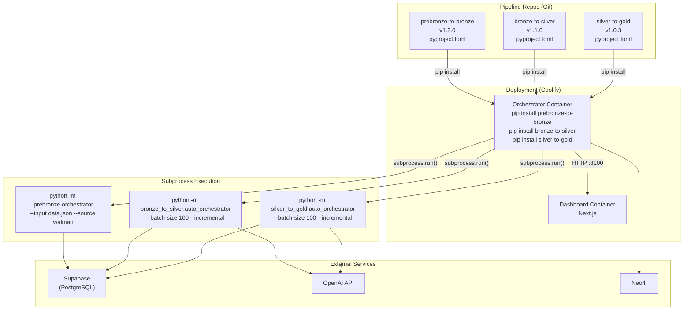

# Pipeline Packaging Strategy: Installable Python Packages

> **Document for:** Pipeline development teams (PreBronze→Bronze, Bronze→Silver, Silver→Gold, Gold→Neo4j)
> **Purpose:** Enable the orchestrator to run your pipeline as a subprocess (`python -m your_pipeline`) instead of relying on filesystem path hacking and fragile in-process imports

---

## Why We Need This

### The Current Problem

Today, the orchestrator finds your pipeline code by scanning sibling directories on the filesystem:

```
Orchestration Pipeline/
├── orchestrator/              ← scans parent directory at runtime
├── prebronze-to-bronze 1/     ← found via glob("prebronze-to-bronze*")
├── bronze-to-silver 1/        ← found via glob("bronze-to-silver*")
├── silver-to-gold 1/          ← found via glob("silver-to-gold*")
└── Gold-to-Neo4j_with_agentic_checks/
```

The orchestrator uses this function to discover your code:

```python
def _ensure_pipeline_on_path(pipeline_dir_name: str):
    base = Path(__file__).resolve().parent.parent.parent
    candidates = sorted(base.glob(f"{pipeline_dir_name}*"))
    for candidate in candidates:
        inner_dirs = sorted(candidate.glob("*/"))
        for inner in inner_dirs:
            if inner.is_dir() and not inner.name.startswith("."):
                sys.path.insert(0, str(inner))
                return
```

This approach has **critical limitations**:

| Problem | Impact |
|---------|--------|
| **Cannot deploy to containers** | Docker/Coolify builds don't have sibling directories — each service is its own container |
| **No version pinning** | The orchestrator always uses whatever code is on disk — no way to pin `bronze-to-silver==1.2.3` |
| **Fragile path discovery** | Directory names with spaces, numbers, or renamed folders break the glob pattern |
| **No dependency resolution** | `pip` cannot verify that pipeline dependencies are compatible with each other |
| **No reproducible builds** | Two developers with slightly different directory layouts get different behavior |
| **Impossible to test in CI** | GitHub Actions / CI runners won't have the same directory structure |

### The Solution: Installable Python Packages + Subprocess Execution

By adding a single `pyproject.toml` file to each pipeline repo, they become standard Python packages that can be:

- **Installed** via `pip install` (locally, from git, or from a registry)
- **Versioned** with semantic versioning
- **Tested** independently in CI
- **Deployed** into any Docker container
- **Executed** as subprocesses with full process isolation

The orchestrator execution changes from:

```python
# ❌ Before: fragile filesystem hack, in-process import
_ensure_pipeline_on_path("prebronze-to-bronze")
from prebronze.orchestrator import run_sequential
result = run_sequential(state)   # runs in orchestrator's process
```

to:

```python
# ✅ After: subprocess execution (process isolation, crash safety)
import subprocess, sys
proc = subprocess.run(
    [sys.executable, "-m", "prebronze.orchestrator",
     "--input", "/tmp/data.json", "--source-name", "walmart"],
    capture_output=True, text=True, timeout=600,
)
# Pipeline runs in its own process — orchestrator stays alive even if it crashes
```

> [!TIP]
> **Why subprocess instead of import?**
>
> - **Crash isolation:** If a pipeline segfaults or runs out of memory, the orchestrator stays alive
> - **Dependency isolation:** Pipeline deps never conflict with orchestrator deps
> - **Independent scaling:** Each pipeline can have its own resource limits
> - **Same code locally and in production:** No divergence between environments

---

## What Each Pipeline Team Needs to Do

### Step 1: Add `pyproject.toml` to Your Repo Root

This is the **only required change**. It tells Python how to install your code as a package.

Below are the exact files for each pipeline:

---

#### PreBronze → Bronze

**File:** `prebronze-to-bronze/pyproject.toml`

```toml
[build-system]
requires = ["hatchling"]
build-backend = "hatchling.build"

[project]
name = "prebronze-to-bronze"
version = "1.0.0"
description = "Agentic ingestion pipeline: CSV/JSON → Bronze tables via LangGraph"
requires-python = ">=3.11"
dependencies = [
    "langchain>=0.1.0",
    "langchain-openai>=0.1.0",
    "langgraph>=0.0.26",
    "pandas>=2.1.0",
    "pyyaml>=6.0",
    "langdetect>=1.0.9",
    "tqdm>=4.66.0",
    "python-dotenv>=1.0.0",
    "supabase>=2.0.3",
]

[project.optional-dependencies]
dev = [
    "pytest>=7.4.0",
    "pytest-cov>=4.1.0",
    "ruff>=0.1.0",
]

[tool.hatch.build.targets.wheel]
# Tell hatch where the importable package lives
packages = ["prebronze"]
```

> [!IMPORTANT]
> The `packages = ["prebronze"]` line under `[tool.hatch.build.targets.wheel]` must point to the **directory name** that contains your Python modules — the one with `__init__.py`. This is the name used in `import prebronze`.

**What the orchestrator runs as a subprocess:**

```bash
python -m prebronze.orchestrator --input /tmp/data.json --source-name walmart --ingestion-run-id <uuid>
```

Make sure the `main()` function in `prebronze/orchestrator.py` and the `if __name__ == "__main__"` block exist and work.

---

#### Bronze → Silver

**File:** `bronze-to-silver/pyproject.toml`

```toml
[build-system]
requires = ["hatchling"]
build-backend = "hatchling.build"

[project]
name = "bronze-to-silver"
version = "1.0.0"
description = "Agentic transformation pipeline: Bronze → Silver via LangGraph"
requires-python = ">=3.11"
dependencies = [
    "langchain>=0.1.0",
    "langchain-openai>=0.1.0",
    "langgraph>=0.0.26",
    "pandas>=2.1.0",
    "pyyaml>=6.0",
    "langdetect>=1.0.9",
    "tqdm>=4.66.0",
    "python-dotenv>=1.0.0",
    "supabase>=2.0.3",
    "requests>=2.31.0",
]

[project.optional-dependencies]
dev = [
    "pytest>=7.4.0",
    "pytest-cov>=4.1.0",
    "ruff>=0.1.0",
]

[tool.hatch.build.targets.wheel]
packages = ["bronze_to_silver"]
```

**What the orchestrator runs as a subprocess:**

```bash
python -m bronze_to_silver.auto_orchestrator --batch-size 100 --incremental
```

---

#### Silver → Gold

**File:** `silver-to-gold/pyproject.toml`

```toml
[build-system]
requires = ["hatchling"]
build-backend = "hatchling.build"

[project]
name = "silver-to-gold"
version = "1.0.0"
description = "Agentic enrichment pipeline: Silver → Gold via LangGraph"
requires-python = ">=3.11"
dependencies = [
    "langchain>=0.1.0",
    "langchain-openai>=0.1.0",
    "langgraph>=0.0.26",
    "pandas>=2.1.0",
    "pyyaml>=6.0",
    "python-dotenv>=1.0.0",
    "supabase>=2.0.3",
]

[project.optional-dependencies]
dev = [
    "pytest>=7.4.0",
    "pytest-cov>=4.1.0",
    "ruff>=0.1.0",
]

[tool.hatch.build.targets.wheel]
packages = ["silver_to_gold"]
```

**What the orchestrator runs as a subprocess:**

```bash
python -m silver_to_gold.auto_orchestrator --batch-size 100 --incremental
```

---

#### Gold → Neo4j

The Gold→Neo4j pipeline is handled differently — its adapter (`neo4j_adapter.py`) lives inside the orchestrator package and references the pipeline via the `NEO4J_PIPELINE_DIR` config setting. No `pyproject.toml` is needed unless the team wants to decouple it further.

---

### Step 2: Verify Your Package Structure

Each pipeline repo should have this structure after adding `pyproject.toml`:

```
your-pipeline-repo/
├── pyproject.toml              ← NEW (the only new file)
├── requirements.txt            ← keep for backward compatibility
├── Dockerfile                  ← existing
├── README.md                   ← existing
├── your_package_name/          ← must match [tool.hatch.build.targets.wheel] packages
│   ├── __init__.py             ← REQUIRED (can be empty)
│   ├── auto_orchestrator.py    ← or whatever modules you expose
│   ├── ...
│   └── other_modules.py
└── tests/                      ← optional but recommended
    └── ...
```

> [!CAUTION]
> **Critical:** Your importable package directory **must** have an `__init__.py` file. Without it, Python won't recognize it as a package and imports will fail. If it doesn't exist, create an empty one:
>
> ```bash
> touch your_package_name/__init__.py
> ```

### Step 3: Test Locally

After adding `pyproject.toml`, verify it works:

```bash
# From your pipeline repo root
cd prebronze-to-bronze/   # or bronze-to-silver/, silver-to-gold/

# Install in editable mode (changes take effect immediately)
pip install -e .

# Verify the import works
python -c "from prebronze.orchestrator import run_sequential; print('✅ Import works')"
```

If the import fails, check:

1. Does the package directory name match what's in `packages = [...]`?
2. Does the package directory have `__init__.py`?
3. Are all dependencies listed in `pyproject.toml`?

---

## How the Orchestrator Uses Your Packages

### Execution Model: Subprocess

The orchestrator runs each pipeline as a **separate subprocess** via `python -m <module>`.
Pipelines are installed as Python packages (via `pip install`) so the module path resolves.
The orchestrator **never imports your code directly** — it only calls your CLI.

```python
# What the orchestrator does internally (simplified)
import subprocess, sys

proc = subprocess.run(
    [sys.executable, "-m", "bronze_to_silver.auto_orchestrator",
     "--batch-size", "100", "--incremental"],
    capture_output=True, text=True,
    timeout=600,
    env=os.environ,  # passes SUPABASE_URL, OPENAI_API_KEY, etc.
)

if proc.returncode != 0:
    raise RuntimeError(f"Pipeline failed: {proc.stderr}")
```

### During Local Development

Use the `local-dev/` setup scripts to install everything:

```bash
# One-time setup (Windows)
cd "Orchestration Pipeline/local-dev"
.\setup_local.ps1

# One-time setup (Unix/macOS)
cd "Orchestration Pipeline/local-dev"
bash setup_local.sh
```

This creates a venv, installs all pipeline deps, and does editable installs.
Then you run the **actual orchestrator** locally — same subprocess code as production:

```bash
python -m orchestrator serve
```

To debug a specific pipeline in isolation, run its CLI directly:

```bash
python -m bronze_to_silver.auto_orchestrator --batch-size 5 --log-level DEBUG
```

### During Docker / Coolify Deployment

The orchestrator's Dockerfile installs your pipeline packages from git URLs:

```dockerfile
# Install orchestrator (no pipeline deps needed in its own package)
COPY pyproject.toml ./
RUN pip install --no-cache-dir -e .

# Install pipeline packages so `python -m <module>` works
RUN pip install --no-cache-dir \
    "prebronze-to-bronze @ git+https://github.com/your-org/prebronze-to-bronze.git@v1.0.0" \
    "bronze-to-silver @ git+https://github.com/your-org/bronze-to-silver.git@v1.0.0" \
    "silver-to-gold @ git+https://github.com/your-org/silver-to-gold.git@v1.0.0"
```

### In CI/CD Pipelines

Each pipeline repo can run its own tests independently:

```yaml
# .github/workflows/test.yml (in each pipeline repo)
name: Test Pipeline
on: [push, pull_request]
jobs:
  test:
    runs-on: ubuntu-latest
    steps:
      - uses: actions/checkout@v4
      - uses: actions/setup-python@v5
        with:
          python-version: "3.12"
      - run: pip install -e ".[dev]"
      - run: pytest
```

---

## Versioning Strategy

### Semantic Versioning (SemVer)

Each pipeline should follow semantic versioning: **`MAJOR.MINOR.PATCH`**

| Change Type | Version Bump | Example | When |
|-------------|-------------|---------|------|
| Breaking API change | MAJOR | `1.0.0` → `2.0.0` | Changed function signatures, removed modules, renamed exports |
| New feature, backward compatible | MINOR | `1.0.0` → `1.1.0` | Added new functions, new optional parameters |
| Bug fix | PATCH | `1.0.0` → `1.0.1` | Fixed a bug, no API changes |

### How to Bump Versions

Edit `version` in `pyproject.toml`:

```toml
[project]
version = "1.1.0"  # ← bump this
```

Then tag the release in git:

```bash
git add pyproject.toml
git commit -m "release: v1.1.0 — add batch processing support"
git tag v1.1.0
git push origin main --tags
```

### Version Pinning in the Orchestrator

The orchestrator Dockerfile pins pipeline versions for stability:

```dockerfile
# orchestrator/Dockerfile — pin to specific git tags
RUN pip install --no-cache-dir \
    "prebronze-to-bronze @ git+https://github.com/your-org/prebronze-to-bronze.git@v1.2.3" \
    "bronze-to-silver @ git+https://github.com/your-org/bronze-to-silver.git@v1.1.0" \
    "silver-to-gold @ git+https://github.com/your-org/silver-to-gold.git@v1.0.5"
```

---

## The CLI Contract (Public API)

Each pipeline must expose a `main()` CLI entry point that the orchestrator calls via subprocess. These are your **public API** — changing them is a **breaking change** (MAJOR version bump).

### Required CLI Entry Points

| Pipeline | Module Path | CLI Command | Key Arguments |
|----------|-------------|-------------|---------------|
| PreBronze→Bronze | `prebronze.orchestrator` | `python -m prebronze.orchestrator` | `--input <file>`, `--source-name <name>`, `--ingestion-run-id <uuid>` |
| Bronze→Silver | `bronze_to_silver.auto_orchestrator` | `python -m bronze_to_silver.auto_orchestrator` | `--batch-size <n>`, `--incremental`, `--dry-run` |
| Silver→Gold | `silver_to_gold.auto_orchestrator` | `python -m silver_to_gold.auto_orchestrator` | `--batch-size <n>`, `--incremental`, `--dry-run` |

### CLI Requirements

Each pipeline's entry module **must** have:

1. A `main()` function that parses CLI args via `argparse`
2. An `if __name__ == "__main__": main()` block
3. Exit code `0` on success, non-zero on failure
4. All output goes to stdout/stderr (logs, progress, errors)

```python
# Example: your_pipeline/auto_orchestrator.py
def main(argv=None):
    parser = argparse.ArgumentParser()
    parser.add_argument("--batch-size", type=int, default=100)
    parser.add_argument("--incremental", action="store_true")
    args = parser.parse_args(argv)

    try:
        result = transform_all_tables(batch_size=args.batch_size, ...)
        # Optionally print JSON summary on last line (orchestrator can parse it)
        print(json.dumps({"total_records_written": result["total_written"]}))
    except Exception as e:
        logger.error(f"Pipeline failed: {e}")
        sys.exit(1)

if __name__ == "__main__":
    main()
```

### Environment Variables (Not CLI Args)

Credentials and connection strings are passed via **environment variables**, NOT CLI args. The orchestrator's environment is automatically inherited by subprocesses.

| Variable | Used By | Description |
|----------|---------|-------------|
| `SUPABASE_URL` | All pipelines | Supabase project URL |
| `SUPABASE_SERVICE_ROLE_KEY` | All pipelines | Service role key for DB access |
| `OPENAI_API_KEY` | All pipelines | OpenAI API key for LLM steps |
| `OPENAI_MODEL_NAME` | All pipelines | Model to use (default: `gpt-4o-mini`) |

> [!WARNING]
> **Do not rename or remove CLI arguments** without coordinating with the orchestrator team. Adding new optional args is always safe (MINOR version bump). Removing or renaming args is a breaking change (MAJOR version bump).

---

## Migration Checklist

Use this checklist when converting your pipeline to an installable package:

### Pipeline Team Checklist

- [ ] Add `pyproject.toml` to repo root (use templates above)
- [ ] Verify `__init__.py` exists in your main package directory
- [ ] Verify `packages = ["your_package"]` matches your directory name
- [ ] Copy dependencies from `requirements.txt` into `pyproject.toml` `dependencies`
- [ ] Verify your `main()` CLI entry point works: `python -m your_package.auto_orchestrator --help`
- [ ] Verify `if __name__ == "__main__": main()` exists in your entry module
- [ ] Test: `pip install -e .` succeeds without errors
- [ ] Test: `python -m your_package.auto_orchestrator --dry-run` runs correctly
- [ ] Tag release: `git tag v1.0.0 && git push --tags`
- [ ] Document all required CLI arguments in `README.md`
- [ ] Document all required environment variables in `README.md`
- [ ] Keep `requirements.txt` for backward compatibility (it can stay)

### Orchestrator Team Checklist (Done ✅)

- [x] Remove `_ensure_pipeline_on_path()` function from `pipelines.py`
- [x] Remove `_initialize_pipeline_llm()` — pipelines handle their own LLM init
- [x] Replace direct imports with `_run_pipeline_subprocess()` calls
- [x] Remove `[pipelines]` extra from orchestrator's `pyproject.toml`
- [x] Update Dockerfile to `pip install` pipelines separately for subprocess use
- [x] Create `local-dev/` folder with setup scripts
- [ ] Verify all integration tests pass with subprocess execution
- [ ] Deploy to Coolify staging and test end-to-end

---

## FAQ

### Q: Do I need to change any of my existing Python code?

**Mostly no.** The main requirement is adding `pyproject.toml` and ensuring your entry module has a `main()` function with `argparse` and an `if __name__ == "__main__"` block. Most pipelines already have this. Your internal pipeline logic stays exactly the same.

### Q: The orchestrator used to import my functions directly. What changed?

The orchestrator now runs your pipeline as a **separate subprocess** (`python -m your_module --args`). This means:

- Your pipeline runs in its own Python process
- Environment variables (like `SUPABASE_URL`) are inherited automatically
- If your pipeline crashes, the orchestrator stays alive
- You manage your own LLM initialization inside your `main()` function

### Q: Will this break my existing Dockerfile?

**No.** Your existing Dockerfile will continue to work. You can optionally update it to use `pip install .` instead of `pip install -r requirements.txt`, but it's not required.

### Q: Can I still run my pipeline standalone?

**Yes!** In fact, that's exactly how the orchestrator runs it now. `python -m your_module --batch-size 10` works the same whether you run it manually or the orchestrator runs it as a subprocess.

### Q: What about the `__MACOSX` directories in our repos?

Those are macOS compression artifacts and should be `.gitignore`'d. They won't affect packaging, but clean them up:

```bash
echo "__MACOSX/" >> .gitignore
rm -rf __MACOSX/
```

### Q: Do we need a private package registry?

**Not initially.** The orchestrator can install directly from git URLs:

```
pip install "prebronze-to-bronze @ git+https://github.com/org/repo.git@v1.0.0"
```

A private registry (like GitHub Packages or a self-hosted one on Coolify) is recommended when you have **5+ services** consuming your packages or need faster CI builds (cached wheels).

---

## Architecture Diagram



---

## Timeline & Priority

| Phase | Task | Owner | Timeline |
|-------|------|-------|----------|
| **Phase 1** | Add `pyproject.toml` to each pipeline repo | Pipeline teams | 1-2 days |
| **Phase 2** | Test `pip install -e .` for each pipeline | Pipeline teams | Same day |
| **Phase 3** | Tag `v1.0.0` releases | Pipeline teams | Same day |
| **Phase 4** | Update orchestrator to use installed packages | Orchestrator team | 1 day |
| **Phase 5** | Build production Dockerfile | Orchestrator team | 1 day |
| **Phase 6** | Deploy to Coolify staging | Both teams | 1 day |

**Total estimated effort: 3-4 working days across both teams.**
