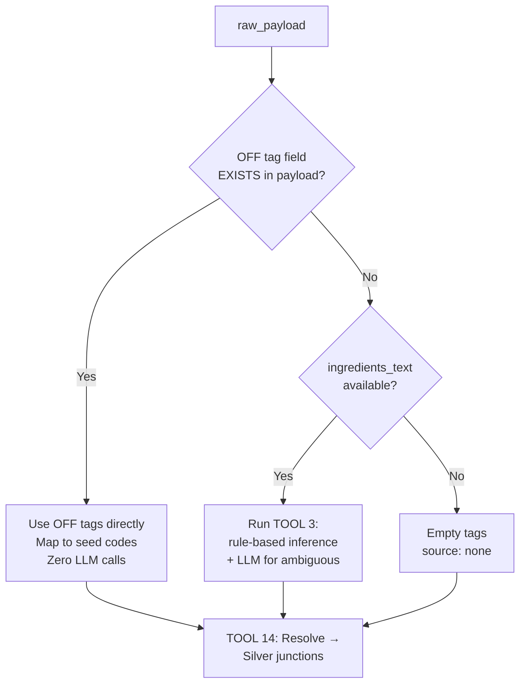
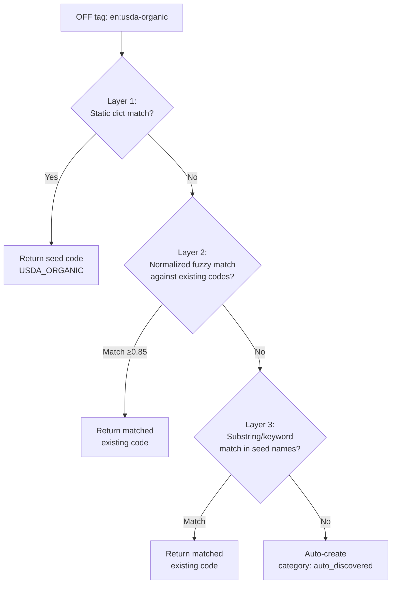

# OFF Product Fields: Schema Gap Analysis & Implementation Strategy

---

## Part 1: Pre-Seeded Data Inventory

### Allergens — 20 entries ([allergens_rows.csv](file:///c:/Users/Sourav%20Patil/Desktop/ASM/Orchestration%20Pipeline/seed%20data/allergens_rows.csv))

| Seed **code** | Seed **category** | OFF `allergens_tags` equivalent |
|---|---|---|
| `Milk (dairy)` | Dairy | `en:milk` |
| `Egg` | Egg | `en:eggs` |
| `Peanut` | Peanut | `en:peanuts` |
| `Tree nuts` | Tree nuts | `en:nuts` |
| `Soy` | Soy | `en:soybeans` |
| `Wheat / gluten cereals` | Cereals/Gluten | `en:gluten` |
| `Fish (finned)` | Fish | `en:fish` |
| `Shellfish — crustaceans` | Shellfish | `en:crustaceans` |
| `Molluscs` | Molluscs | `en:molluscs` |
| `Sesame (seed)` | Sesame | `en:sesame-seeds` |
| `Celery` | Celery | `en:celery` |
| `Corn (maize)` | Corn/Maize | — (no OFF equivalent) |
| `Buckwheat (pseudo-cereal)` | Buckwheat | — |
| + 7 more niche (OAS, Alpha-gal, Gelatin, Seeds, Legumes, Insects, Spices) | | |

### Diets — 32 entries ([diets_rows.csv](file:///c:/Users/Sourav%20Patil/Desktop/ASM/Orchestration%20Pipeline/seed%20data/diets_rows.csv))

| Seed **code** | Seed **category** | OFF source |
|---|---|---|
| `VEGAN` | ETHICAL_RELIGIOUS | `en:vegan` |
| `VEGETARIAN` | LIFESTYLE | `en:vegetarian` |
| `KOSHER` | ETHICAL_RELIGIOUS | `en:kosher` |
| `HALAL` | ETHICAL_RELIGIOUS | `en:halal` |
| `DAIRY_FREE` | ALLERGEN_LIFESTYLE | `en:no-lactose`, `en:lactose-free` |
| `CELIAC_GLUTEN_FREE` | MEDICAL_THERAPEUTIC | `en:no-gluten`, `en:gluten-free` |
| + 26 more (KETO, PALEO, PESCATARIAN, LOW_FODMAP, CARNIVORE, etc.) | | |

### Certifications — 31 entries ([certifications_rows.csv](file:///c:/Users/Sourav%20Patil/Desktop/ASM/Orchestration%20Pipeline/seed%20data/certifications_rows.csv))

| Seed **code** | Seed **category** | OFF source |
|---|---|---|
| `USDA_ORGANIC` | ORGANIC | `en:usda-organic` |
| `EU_ORGANIC` | ORGANIC | `en:eu-organic` |
| `KOSHER_OU` | RELIGIOUS | `en:orthodox-union-kosher` |
| `NON_GMO_PROJECT` | NON_GMO | `en:non-gmo-project-verified` |
| `FAIRTRADE` | SUSTAINABILITY | `en:fair-trade` |
| `RAINFOREST_ALLIANCE` | SUSTAINABILITY | `en:rainforest-alliance` |
| + 25 more (FSSC_22000, BRC, ASC, GF_GFCO, etc.) | | |

> [!IMPORTANT]
> Seed codes use **different formats**: allergens = `Human Readable` (`Milk (dairy)`), diets/certs = `SCREAMING_SNAKE` (`USDA_ORGANIC`). OFF uses `en:kebab-case`. Static mapping dictionaries + fuzzy normalization are required.

---

## Part 2: OFF → Seed Code Mapping Dictionary

```python
OFF_TO_ALLERGEN_CODE = {
    "en:milk": "Milk (dairy)",
    "en:eggs": "Egg",
    "en:peanuts": "Peanut",
    "en:nuts": "Tree nuts",
    "en:soybeans": "Soy",
    "en:gluten": "Wheat / gluten cereals",
    "en:fish": "Fish (finned)",
    "en:crustaceans": "Shellfish — crustaceans",
    "en:molluscs": "Molluscs",
    "en:sesame-seeds": "Sesame (seed)",
    "en:celery": "Celery",
    "en:mustard": "Seeds (non-sesame)",
    "en:lupin": "Other legumes",
}

OFF_TO_DIET_CODE = {
    "en:vegan": "VEGAN",
    "en:vegetarian": "VEGETARIAN",
    "en:no-gluten": "CELIAC_GLUTEN_FREE",
    "en:gluten-free": "CELIAC_GLUTEN_FREE",
    "en:no-lactose": "DAIRY_FREE",
    "en:lactose-free": "DAIRY_FREE",
    "en:halal": "HALAL",
    "en:kosher": "KOSHER",
}

OFF_TO_CERT_CODE = {
    "en:organic": "USDA_ORGANIC",
    "en:usda-organic": "USDA_ORGANIC",
    "en:eu-organic": "EU_ORGANIC",
    "en:non-gmo-project-verified": "NON_GMO_PROJECT",
    "en:fair-trade": "FAIRTRADE",
    "en:rainforest-alliance": "RAINFOREST_ALLIANCE",
    "en:orthodox-union-kosher": "KOSHER_OU",
    "en:msc": "MSC_CERTIFIED",
    "en:asc": "ASC_CERTIFIED",
}
```

---

## Part 3: Tag Classification — Routing `labels_tags`

```python
def classify_off_tag(tag: str) -> tuple[str, str]:
    """Classify OFF tag → (bucket, seed_code). Returns ('unknown', tag) if no match."""
    if tag in OFF_TO_DIET_CODE:
        return ("diet", OFF_TO_DIET_CODE[tag])
    if tag in OFF_TO_CERT_CODE:
        return ("certification", OFF_TO_CERT_CODE[tag])
    tag_clean = tag.replace("en:", "").lower()
    if any(kw in tag_clean for kw in {"vegan","vegetarian","gluten-free","lactose-free","keto","paleo"}):
        return ("diet", tag_clean.upper().replace("-", "_"))
    return ("certification", tag_clean.upper().replace("-", "_"))
```

---

## Part 4: Tag Strategy — OFF-Only vs LLM Fallback (Conditional)

### Current Problem (TOOL 3)

```
Every product → keyword matching on ingredients_text → diet_tags[], allergen_tags[]
             → LLM fallback for ambiguous cases
```

**Problems:** (1) Ignores OFF source tags entirely. (2) Runs LLM on every product even when OFF already has the answer.

### Key Insight: Empty Array ≠ Missing Field

```python
# Case A: Field exists but empty → "no allergens declared" (valid data!)
{"allergens_tags": []}        # Trust this. No LLM needed.

# Case B: Field missing entirely → data gap
# "allergens_tags" not in payload  # Fallback to rules/LLM

# Case C: Field populated → use directly
{"allergens_tags": ["en:milk", "en:eggs"]}  # Use this. No LLM.
```

### Revised Strategy: Conditional, Never Merged

> **OFF tags present → deterministic mapping, zero LLM.**
> **OFF tags missing → rule-based first, LLM only for ambiguous.**
> **Never merge OFF + LLM for the same field — OFF wins, period.**



### Implementation

```python
def resolve_tags(raw_payload: dict, ingredients_text: str):
    # ── Allergens ──
    if "allergens_tags" in raw_payload:
        # OFF field EXISTS → trust entirely, no LLM
        allergen_tags = raw_payload["allergens_tags"]
        source = "off_declared"
    elif ingredients_text:
        # OFF field MISSING → TOOL 3 fallback
        allergen_tags = _infer_allergen_tags(ingredients_text)
        source = "inferred_rules"
    else:
        allergen_tags, source = [], "none"

    # ── Diets / Certifications (from labels_tags) ──
    if "labels_tags" in raw_payload:
        diet_tags, cert_tags = _classify_labels(raw_payload["labels_tags"])
        # No LLM — labels are factual certifications
    elif ingredients_text:
        diet_tags = _infer_diet_tags(ingredients_text)  # TOOL 3
        cert_tags = []  # can't infer certifications from text
    else:
        diet_tags, cert_tags = [], []
```

### TOOL 3 Becomes Conditional

```python
# In the pipeline orchestrator:
if product_has_off_tags(row):
    # SKIP TOOL 3 — OFF tags already extracted in flattener
    pass
else:
    # No OFF data → run TOOL 3 (rules + LLM fallback)
    _infer_and_apply_tags(row)
```

### Why NOT Merge OFF + LLM?

| | OFF Tags | LLM Inference |
|---|---|---|
| **Source** | Product label / certification body | Statistical prediction |
| **Accuracy** | Factual (legal obligation) | Probabilistic (can hallucinate) |
| **Cost** | Free (already in payload) | $$ per API call |
| **Speed** | Instant | 500ms–2s per call |
| **Risk** | N/A (packaging truth) | False allergen → user panic; missing → health risk |

Merging risks LLM adding noise (e.g., hallucinating an allergen that contradicts the package). OFF data is the manufacturer's legal declaration — it should never be "supplemented" by inference.

---

## Part 5: Broad Auto-Mapping — Only Create When Truly New

### Strategy: Multi-Layer Matching Before Auto-Create



### Layer 2: Fuzzy Normalization

Normalize both OFF tag and seed codes to a **canonical form** before comparing:

```python
def _normalize_for_matching(s: str) -> str:
    """Normalize any tag/code to a common form for comparison."""
    s = s.lower()
    s = s.replace("en:", "")         # "en:usda-organic" → "usda-organic"
    s = re.sub(r'[^a-z0-9]', '', s)  # strip all non-alphanumeric
    return s                          # "usdaorganic"

# Pre-compute normalized seed codes at startup
SEED_ALLERGENS_NORMALIZED = {
    _normalize_for_matching(row["code"]): row["code"]
    for row in seed_allergens
}
# "milkdairy" → "Milk (dairy)", "egg" → "Egg", "peanut" → "Peanut"

def _fuzzy_match_seed(off_tag: str, normalized_seed_map: dict) -> str | None:
    norm = _normalize_for_matching(off_tag)
    # Exact normalized match
    if norm in normalized_seed_map:
        return normalized_seed_map[norm]
    # Substring containment (either direction)
    for seed_norm, seed_code in normalized_seed_map.items():
        if norm in seed_norm or seed_norm in norm:
            return seed_code
    return None
```

### Layer 3: Keyword Matching

```python
def _keyword_match_seed(off_tag: str, seed_entries: list[dict]) -> str | None:
    """Check if OFF tag keywords appear in seed name/description."""
    tag_words = set(_normalize_for_matching(off_tag))
    for entry in seed_entries:
        name_words = _normalize_for_matching(entry["name"])
        # If OFF tag is a substring of seed name
        if _normalize_for_matching(off_tag) in name_words:
            return entry["code"]
    return None
```

### Edge Cases & How They're Handled

| Edge Case | OFF Tag | Expected Match | How |
|---|---|---|---|
| **Plural vs singular** | `en:eggs` | `Egg` | Layer 2: `eggs` → `egg` ⊂ `egg` ✅ |
| **Hyphen vs space** | `en:sesame-seeds` | `Sesame (seed)` | Layer 2: `sesameseeds` ⊃ `sesameseed` ✅ |
| **Partial overlap** | `en:milk-proteins` | `Milk (dairy)` | Layer 2: `milkproteins` ⊃ `milk` → Layer 3 substring ✅ |
| **Regional variant** | `en:ab-agriculture-biologique` | `EU_ORGANIC` | Layer 1 static dict (expand) or Layer 2 miss → auto-create |
| **Different wording** | `en:no-preservatives` | — no match — | All layers miss → **auto-create** `NO_PRESERVATIVES` ✅ |
| **Duplicate semantics** | `en:organic` then `en:usda-organic` | Both → `USDA_ORGANIC` | Layer 1 static dict handles both ✅ |
| **Extremely niche** | `en:south-west-france-igp` | — no match — | All layers miss → **auto-create** ✅ |
| **Allergen sub-type** | `en:almonds` | `Tree nuts` | Layer 1: add `"en:almonds": "Tree nuts"` to dict |
| **Status tag** | `en:vegan-status-unknown` | `VEGAN`? | Layer 2: `veganstatusunknown` ⊃ `vegan` → **careful!** Should NOT match. Add to exclusion list. |
| **Negation** | `en:non-vegan` | — should NOT match `VEGAN` — | Layer 2: `nonvegan` ⊃ `vegan` → **false positive!** Add negation check. |

### Safeguards Against False Positives

```python
NEGATION_PREFIXES = {"non", "not", "no"}  # "non-vegan" should NOT match "VEGAN"
STATUS_SUFFIXES = {"unknown", "status-unknown", "maybe"}

def _is_safe_substring_match(off_norm: str, seed_norm: str) -> bool:
    """Check if substring match is semantically safe."""
    # Reject if OFF tag starts with negation
    for neg in NEGATION_PREFIXES:
        if off_norm.startswith(neg) and off_norm[len(neg):] == seed_norm:
            return False  # "nonvegan" should not match "vegan"
    # Reject if OFF tag has "unknown/maybe" status suffix
    for suffix in STATUS_SUFFIXES:
        if suffix.replace("-","") in off_norm:
            return False  # "veganstatusunknown" → reject
    return True
```

### Final `_get_or_create` with All Layers

```python
def _get_or_create_silver_allergen(client, off_tag: str, seed_cache: dict) -> str | None:
    # Layer 1: Static dict
    seed_code = OFF_TO_ALLERGEN_CODE.get(off_tag)
    if seed_code:
        return _lookup_by_code(client, "allergens", seed_code)
    
    # Layer 2: Fuzzy normalized match
    seed_code = _fuzzy_match_seed(off_tag, seed_cache["allergens_normalized"])
    if seed_code:
        return _lookup_by_code(client, "allergens", seed_code)
    
    # Layer 3: Keyword match against names
    seed_code = _keyword_match_seed(off_tag, seed_cache["allergens_entries"])
    if seed_code:
        return _lookup_by_code(client, "allergens", seed_code)
    
    # Layer 4: Auto-create (truly new)
    auto_code = off_tag.replace("en:", "").replace("-", "_").upper()
    human_name = off_tag.replace("en:", "").replace("-", " ").title()
    ins = client.schema("silver").table("allergens").insert({
        "code": auto_code,
        "name": human_name,
        "category": "auto_discovered",
        "is_top_9": False,
    }).execute()
    logger.info(f"Auto-created silver.allergens: {auto_code} (from OFF {off_tag})")
    return str(ins.data[0]["id"]) if ins.data else None
```

---

## Part 6: `gtin_type` and `manufacturer`

```python
silver_row["gtin_type"] = _derive_gtin_type(silver_row.get("barcode"))
silver_row["manufacturer"] = raw_payload.get("manufacturing_places") or None

def _derive_gtin_type(barcode: str) -> str | None:
    if not barcode: return None
    digits = re.sub(r'\D', '', barcode)
    return {8:"GTIN-8", 12:"GTIN-12", 13:"GTIN-13", 14:"GTIN-14"}.get(len(digits))
```

---

## Part 7: Gap 1 — Category Hierarchy is Flat

### Current Problem

Pipeline extracts single `category_code` string. OFF provides a DAG in `categories_tags`:

```json
["en:spreads", "en:fats", "en:margarines", "en:plant-based-spreads"]
```

### Implementation

**No junction table needed.** `silver.products.category_tags TEXT[]` stores the raw array. `silver.product_categories` stores the hierarchy with `parent_code`, `level`, `path`.

**Storage:**

| Layer | Where | What |
|---|---|---|
| Silver | `products.category_tags TEXT[]` | Raw OFF array for traceability |
| Silver | `products.category_code` | Primary/leaf category (backward compat) |
| Silver | `product_categories` table | Each unique category with parent-child via `parent_code`, `level`, `path` |
| Gold | `products.category_id UUID FK` | Points to leaf (most specific) category |
| Gold | `product_categories` table | Hierarchy via `parent_category_id UUID FK` |

**Query examples:**

```sql
-- All categories for a product
SELECT pc.* FROM silver.products p, unnest(p.category_tags) AS tag
JOIN silver.product_categories pc ON pc.code = tag WHERE p.id = '<uuid>';

-- All products in a category
SELECT * FROM silver.products WHERE category_tags @> ARRAY['margarines'];
```

**TOOL 14 builds hierarchy:**

```python
def _resolve_categories(client, category_tags: list):
    for tag in category_tags:
        code = tag.replace("en:", "")
        existing = client.schema("silver").table("product_categories") \
            .select("id").eq("code", code).limit(1).execute()
        if not existing.data:
            parent_code = _find_parent_in_tags(code, category_tags)
            client.schema("silver").table("product_categories").insert({
                "code": code,
                "name": code.replace("-", " ").title(),
                "parent_code": parent_code,
                "level": 1 if not parent_code else _get_level(client, parent_code) + 1,
                "path": _build_path(client, parent_code, code),
            }).execute()
```

---

## Part 8: S2G — Thin ID-Mapping Copy

| Silver Source | Gold Destination | Logic |
|---|---|---|
| `silver.products` (`is_canonical=true` only) | `gold.products` | Column mapping + `data_lineage` |
| `silver.product_allergens` | `gold.product_allergens` | Map IDs via lineage |
| `silver.product_diets` | `gold.product_dietary_preferences` | Map IDs via lineage |
| `silver.product_certifications` | `gold.product_certifications` | Map IDs via lineage |
| `silver.product_categories` | `gold.product_categories` | Map hierarchy; leaf → `gold.products.category_id` |

---

## Part 9: Complete Schema Change Summary

### Silver Layer

| Change | Type | Details |
|---|---|---|
| `silver.certifications` | **New table** | `code UNIQUE`, `name`, `category`, `region` |
| `silver.product_allergens` | **New junction** | `product_id` → `allergen_id`, `source_type`, `confidence` |
| `silver.product_diets` | **New junction** | `product_id` → `diet_id`, `is_compatible`, `source_type` |
| `silver.product_certifications` | **New junction** | `product_id` → `certification_id`, `source_type` |
| `silver.products` | **+7 columns** | `nutriscore_grade`, `nova_group`, `ingredients_analysis_tags`, `ecoscore_grade`, `food_groups_tags`, `category_tags`, `normalized_barcode` |

> [!NOTE]
> Deduplication columns and strategy are documented separately in [Product Dedup Implementation Strategy](file:///C:/Users/Sourav%20Patil/.gemini/antigravity/brain/cc763d51-88ef-4212-a28f-771885db30d6/product_dedup_implementation_strategy.md).

### Gold Layer

| Change | Type | Details |
|---|---|---|
| `gold.products` | **+5 columns** | `nutriscore_grade`, `nova_group`, `ingredients_analysis_tags`, `ecoscore_grade`, `food_groups_tags` |

### Bronze Layer — **Zero changes**

---

## Part 10: Implementation Roadmap

| # | Task | Where | Pipeline |
|---|---|---|---|
| 1 | SQL migration (1 table + 3 junctions + 7 columns Silver, 5 columns Gold) | Migration file | — |
| 2 | Seed `silver.certifications` from seed CSV | Seed script | — |
| 3 | Extract OFF tags + scores + gtin_type + manufacturer | `payload_flattener.py` | B2S |
| 4 | Tag classification (OFF → diet/cert/allergen routing) | `payload_flattener.py` | B2S |
| 5 | Conditional TOOL 3 (skip when OFF tags exist) | `B2S core.py` | B2S |
| 6 | TOOL 14: Broad auto-mapping → Silver junctions | `B2S core.py` (new) | B2S |
| 7 | Category hierarchy builder (DAG-aware) | `B2S core.py` (TOOL 14) | B2S |
| 8 | S2G product tools (fetch → transform → load → junctions) | `S2G core.py` (new) | S2G |

