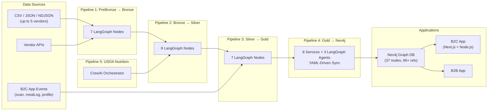
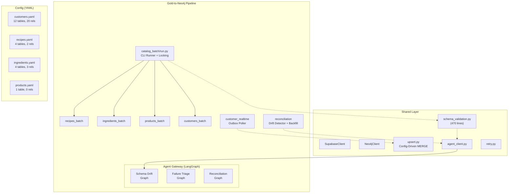
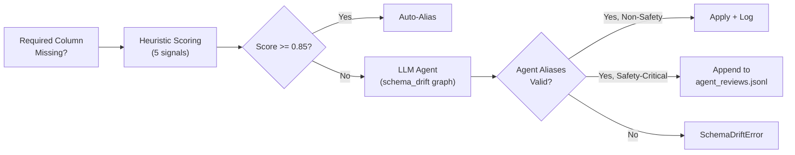
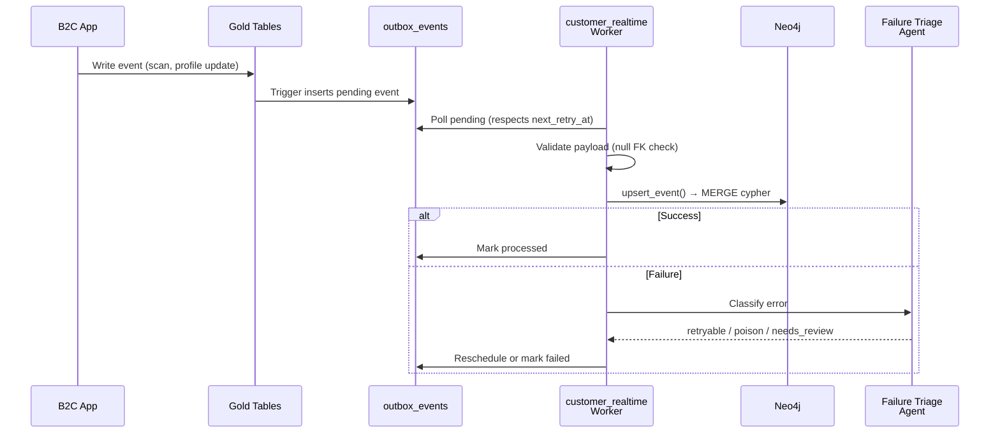

# Data Orchestration Pipeline — Deep Research & Architecture Proposal (v3)

> **Updated:** February 21, 2026 — incorporates full Gold-to-Neo4j pipeline code analysis, Neo4j graph architecture v3.0 spec, and latest bronze/silver/gold SQL schemas.

---

## 1. Codebase Analysis Summary

### 1.1 Current Ecosystem Overview

The ASM platform spans **5 pipeline repositories**, **2 application frontends**, **2 backends**, and a **graph database**, all deployed via Docker on **Coolify**:



### 1.2 Pipeline Inventory (5 Pipelines)

| # | Pipeline | Repo | Framework | Processing Units | Input → Output |
|---|----------|------|-----------|------------------|----------------|
| 1 | PreBronze → Bronze | `prebronze-to-bronze` | LangGraph | 7 nodes | CSV/JSON/NDJSON → `bronze.*` (5 tables) |
| 2 | Bronze → Silver | `bronze-to-silver` | LangGraph | 8 nodes | `bronze.*` → `silver.*` (31 tables) |
| 3 | Silver → Gold | `silver-to-gold` | LangGraph | 7 nodes | `silver.*` → `gold.*` (64 tables) |
| 4 | Gold → Neo4j | `Gold-to-Neo4j_services` | LangGraph + Heuristic | 8 services, 3 agent workflows | `gold.*` → Neo4j (37 nodes, 86+ rels) |
| 5 | USDA Nutrition | `nutrition_usda_crewai` | CrewAI | 4 agents | USDA API → `silver.nutrition_facts` |

### 1.3 Pipeline Detail: PreBronze → Bronze

| Aspect | Detail |
|--------|--------|
| **Framework** | LangGraph `StateGraph` with `OrchestratorState` (TypedDict) |
| **LLM Usage** | Column mapping fallback, translation, semantic validation |

**7 Sequential Nodes:**
1. `map_tables` — Auto-classify data to correct bronze table
2. `infer_schema_and_map_columns` — Map vendor columns to bronze schema
3. `detect_and_translate_non_english` — Translate non-English text
4. `detect_missing_must_have_attributes` — Semantic completeness check
5. `validate_against_bronze_schema` — Strict DDL validation
6. `render_bronze_csv` — Produce bronze-ready CSV
7. `load_into_supabase` — Upsert into Supabase

**Bronze Tables (5):** `raw_products`, `raw_recipes`, `raw_ingredients`, `raw_customers`, `raw_customer_health_profiles`

### 1.4 Pipeline Detail: Bronze → Silver

| Aspect | Detail |
|--------|--------|
| **Framework** | LangGraph `StateGraph` with `SilverTransformState` |
| **LLM Usage** | Tag inference, semantic normalization, DQ rule generation |
| **Special** | `auto_orchestrator.py` auto-discovers bronze tables |

**8 Sequential Nodes:**
1. `fetch_bronze_records` — Incremental fetch from bronze
2. `flatten_payloads` — Extract typed columns from raw JSON
3. `infer_and_apply_tags` — LLM-powered tagging
4. `normalize_semantic_values` — Canonical value normalization
5. `validate_data_quality` — DQ rule evaluation + issue logging
6. `extract_nutrition_facts` — Parse nutrition data
7. `calculate_recipe_nutrition` — Aggregate nutrition per recipe
8. `load_into_silver` — Upsert + DQ issues + nutrition facts

**Silver Tables (31):** `products`, `recipes`, `allergens_info`, `b2b_customer_allergens`, `b2b_customer_dietary_preferences`, `b2b_customer_health_profiles`, `b2b_customers`, `diet_ingredient_rules`, `diets`, `health_condition_nutrient_thresholds`, `health_condition_rules`, `health_conditions`, `household_budgets`, `households`, `ingredient_allergens`, `ingredient_synonyms`, `ingredients`, `meal_plan_items`, `meal_plans`, `nutrition_categories`, `nutrition_definitions`, `nutrition_facts`, `product_allergens`, `product_categories`, `product_certifications`, `product_dietary_preferences`, `product_images`, `product_ingredients`, `recipe_ingredients`, `recipe_nutrition_profiles`, `shopping_lists`

### 1.5 Pipeline Detail: Silver → Gold

| Aspect | Detail |
|--------|--------|
| **Framework** | LangGraph `StateGraph` with `GoldTransformState` |
| **Special** | Auto-discovery, multiple workflows, data lineage tracking |

**7 Nodes:** Fetch silver records → resolve relationships → enrich/merge entities → compute DQ scores → apply business rules → upsert to Gold → log lineage.

**Gold Tables (64):** Including `products`, `recipes`, `ingredients`, `b2c_customers`, `b2b_customers`, `households`, `allergens`, `allergen_synonyms`, `dietary_preferences`, `health_conditions`, `certifications`, `cuisines`, `vendors`, `age_bands`, `nutrition_definitions` (117 nutrients), `nutrition_categories` (26 categories), `nutrition_facts`, `customer_product_interactions`, `data_lineage`, `data_quality_scores`, `meal_plans`, `meal_plan_items`, `meal_logs`, `meal_log_items`, `shopping_lists`, `shopping_list_items`, `scan_history`, `api_keys`, `audit_log`, and 35+ more junction/rule/profile tables.

---

## 2. Gold → Neo4j Pipeline — Deep Analysis

> [!IMPORTANT]
> This section is based on the actual `Gold-to-Neo4j_with_agentic_checks` codebase, not speculative descriptions. Every detail below is sourced from the scanned code.

### 2.1 Architecture Overview

The pipeline is a **modular, service-oriented Python application** with 8 services, 4 YAML domain configs, and a shared utility layer:



### 2.2 Service Breakdown

| Service | File | Lines | Purpose |
|---------|------|-------|---------|
| `catalog_batch` | `run.py` | 132 | CLI runner: `--layer {recipes,ingredients,products,customers,all}`. File-based locking, sequential execution per layer order |
| `recipes_batch` | `service.py` | 162 | Incremental batch sync for recipes + cuisines + recipe_ingredients. Supports enrichment (lookup cuisine_code from cuisines) |
| `ingredients_batch` | `service.py` | ~162 | Batch sync for ingredients + nutrition_facts + nutrition_definitions + nutrition_categories. Links `HAS_NUTRITION_VALUE` + `OF_NUTRIENT` relationships |
| `products_batch` | `service.py` | ~162 | Batch sync for products with 21 inline nutrition properties |
| `customers_batch` | `service.py` | ~162 | Batch sync for b2c_customers + health profiles + allergens + dietary preferences + households + certifications + interactions. 20 relationship types |
| `customer_realtime` | `service.py` | 106 | Outbox poller: fetches pending events from `outbox_events` table, processes with retry logic and LLM-powered failure triage |
| `reconciliation` | `service.py` | 117 | Drift detector: compares Supabase row counts vs Neo4j node counts, sample ID checksums, triggers LLM-powered backfill proposals |
| `agent_gateway` | `graphs.py` | 242 | 3 LangGraph `StateGraph` workflows for schema drift, failure triage, and reconciliation |

### 2.3 YAML Config-Driven Sync Pattern

Each domain is defined by a YAML config that specifies:

```yaml
sync:
  mode: incremental          # Fetch only rows updated since last checkpoint
  state_file: customers_state.json  # Checkpoint file per domain
  page_size: 1000             # Supabase pagination batch size

schema: gold                  # Source schema in Supabase

tables:
  b2c_customers:
    label: B2C_Customer       # Neo4j node label
    primary_key: id           # MERGE key
    updated_at: updated_at    # Incremental sync column
    safety_critical: false    # If true, agent aliases require manual review
    columns: [id, email, full_name, ...]

relationships:
  - name: customer_has_profile
    type: HAS_PROFILE
    source_table: b2c_customers
    target_table: b2c_customer_health_profiles
    join_table: b2c_customer_health_profiles
    join_source_key: b2c_customer_id
    join_target_key: id
    filters:                  # Optional row-level filters
      entity_type: product
      interaction_type: viewed
```

**Config Inventory:**

| Config | Tables | Relationships | Key Neo4j Labels |
|--------|--------|---------------|------------------|
| `customers.yaml` | 12 | 20 | B2C_Customer, Household, Allergens, Dietary_Preferences, Certificates |
| `recipes.yaml` | 4 | 2 | Recipe, Cuisine, Ingredient |
| `ingredients.yaml` | 4 | 3 | Ingredient, IngredientNutritionValue, NutrientDefinition, NutritionCategory |
| `products.yaml` | 1 | 0 | Product (with 21 inline nutrition columns) |

### 2.4 Agentic Schema Drift Resolution

The `schema_validation.py` module (470 lines) implements a **multi-signal column matching system** that handles schema evolution:



**5 Heuristic Scoring Signals (weighted):**

| Signal | Weight | Description |
|--------|--------|-------------|
| Name similarity | 0.45 | SequenceMatcher + token overlap + suffix bonus |
| Type match | 0.25 | Postgres type compatibility (int4↔int8, varchar↔text) |
| Primary key match | 0.15 | Is-unique constraint check |
| Foreign key match | 0.10 | FK target presence |
| Value shape | 0.05 | Sample data type validation (UUID regex, int check) |

**Safety-Critical Tables:** Tables flagged `safety_critical: true` (allergens, dietary_preferences, health profiles) require human review of agent-proposed aliases — written to `state/agent_reviews.jsonl`.

### 2.5 Agent Gateway — 3 LangGraph Workflows

All 3 workflows use `litellm.completion()` with `gpt-4.1-mini` (configurable via `AGENT_LLM_MODEL`):

| Workflow | States | Purpose | Input | Output |
|----------|--------|---------|-------|--------|
| **Schema Drift** | `candidates` → `llm` → `validate` | Resolve missing columns by proposing aliases | Table name, missing cols, available cols, schema contract | `{ aliases: {expected: actual}, confidence, reason }` |
| **Failure Triage** | `llm` → `validate` | Classify errors as retryable/poison/needs_review | Error message, event type, retry count | `{ classification, error_code, retry_in_seconds }` |
| **Reconciliation** | `check` → `llm` → `validate` | Propose backfill window when drift detected | Source/target counts, drift threshold | `{ action: "backfill"/"observe", from, to, reason }` |

### 2.6 Realtime Event Processing (Outbox Pattern)

The `customer_realtime` service uses a **transactional outbox pattern**:

1. B2C app writes events to `outbox_events` table (status: `pending`)
2. Worker polls for pending events (respects `next_retry_at`)
3. Validates payload (null foreign key → `EventValidationError`, non-retryable)
4. Upserts to Neo4j via `upsert_event()`
5. Marks event as `processed` on success
6. On failure: calls LLM `failure_triage` agent to classify error
   - `retryable` → reschedule with backoff
   - `poison`/`needs_review` → mark failed, log for inspection

### 2.7 Reconciliation Service

Runs periodically across all 4 domain configs:
1. Counts rows per table in Supabase Gold
2. Counts nodes per label in Neo4j
3. Computes SHA-256 checksums on sampled IDs (top 200 sorted)
4. If drift ratio ≥ threshold (default 0.5%), triggers LLM `reconciliation` agent
5. Agent proposes a backfill window → appended to `state/reconcile_plans.jsonl`

---

## 3. Neo4j Graph Architecture v3.0

### 3.1 Node Types (37 Total)

| Layer | Nodes | V3.0 Changes |
|-------|-------|-------------|
| **Customer** (6) | B2CCustomer, B2BCustomer, B2CHealthProfile, B2BHealthProfile, Household, HouseholdPreference | None |
| **Product** (4) | Product, ProductNutritionValue*, ProductSubstitution, ProductAgeRestriction | Product gets +21 inline nutrition props |
| **Ingredient** (3) | Ingredient, IngredientNutritionValue*, Compound | Ingredient gets +20 inline nutrition props |
| **Recipe** (4) | Recipe, RecipeNutritionValue*, RecipeRating, MealRelated | Recipe gets +3 inline nutrition props |
| **Nutrition Taxonomy** (2) | NutrientDefinition* (117 nodes), NutritionCategory* (26 nodes) | NEW shared master data |
| **Meal Planning** (4) | MealPlan, MealPlanItem, ShoppingList, ShoppingListItem | None |
| **Health & Safety** (5) | HealthCondition, Allergen, DietaryPreference, HealthConditionNutrientThreshold, HealthConditionIngredientRestriction | None |
| **Taxonomy** (9) | Vendor, Cuisine, Category, Certification, Brand, Document, Image, Season, Region | None |

*\*NEW in v3.0*

### 3.2 Relationship Types (86+ Total)

| Domain | Count | Key Relationships |
|--------|-------|-------------------|
| Customer-Centric | 30 | HAS_PROFILE, HAS_CONDITION, ALLERGIC_TO, FOLLOWS_DIET, PURCHASED, VIEWED, RATED, SAVED, REJECTED, BELONGS_TO_HOUSEHOLD |
| Product | 12 | SOLD_BY, CONTAINS_INGREDIENT, BELONGS_TO_CATEGORY, HAS_CERTIFICATION, MANUFACTURED_BY, SUBSTITUTE_FOR |
| Ingredient | 8 | CONTAINS_ALLERGEN, CONTAINS_COMPOUND, SUBSTITUTE_FOR, DERIVED_FROM |
| Recipe | 6 | USES_INGREDIENT, USES_PRODUCT, BELONGS_TO_CUISINE, SUITABLE_FOR_DIET |
| Health & Safety | 13 | REQUIRES_LIMIT, RESTRICTS, RECOMMENDS, FORBIDS, REQUIRES_NUTRIENT_LIMIT* |
| Age-Based | 2 | RESTRICTED_FOR_AGE, SAFE_FOR_AGE |
| Meal Planning | 7 | CONTAINS, USES_RECIPE, GENERATED_FROM, REFERENCES |
| Recipe Enhancement | 3 | RATED_RECIPE, USED_IN_MEAL |
| Taxonomy | 5 | PARENT_OF (hierarchical) |
| **Nutrition (NEW)** | **8** | HAS_NUTRITION_VALUE (×3), OF_NUTRIENT (×3), BELONGS_TO_CATEGORY, PARENT_OF |

### 3.3 V3.0 Hybrid Nutrition Pattern

```
Product ──HAS_NUTRITION_VALUE──→ ProductNutritionValue ──OF_NUTRIENT──→ NutrientDefinition
         (inline: top 21 props)   (per-nutrient, per-source)           (117 shared master nodes)
                                                                          │
                                                                     BELONGS_TO_CATEGORY
                                                                          │
                                                                    NutritionCategory
                                                                     (26 categories)
```

**Why hybrid?** 80% of queries use only 20-21 FDA-required nutrients → inline properties enable <10ms queries. The full 117-attribute `NutritionValue` node graph provides completeness for USDA/Spoonacular deep lookups.

---

## 4. Supabase SQL Schema Analysis

### 4.1 Table Counts by Layer

| Layer | Tables | Key Tables |
|-------|--------|------------|
| **Bronze** | 5 | `raw_products`, `raw_recipes`, `raw_ingredients`, `raw_customers`, `raw_customer_health_profiles` |
| **Silver** | 31 | `products`, `recipes`, `ingredients`, + health/nutrition/diet reference tables |
| **Gold** | 64 | Full entity model: products, customers (B2C/B2B), recipes, ingredients, nutrition (definitions/categories/facts), health conditions, allergens, dietary preferences, meal planning, interactions, audit, data quality, lineage |

### 4.2 Key Gold Schema Highlights

**Nutrition Subsystem (v3.0):**
- `nutrition_definitions` — 117 master nutrients (USDA + Spoonacular IDs)
- `nutrition_categories` — 26 hierarchical categories (8 top-level + 18 subcategories)
- `nutrition_facts` — Per-entity nutrition values with `entity_type` filter
- `recipe_nutrition_profiles` — Aggregated recipe nutrition

**Customer Subsystem:**
- `b2c_customers` — Individual members within households
- `b2b_customers` — Vendor-isolated enterprise customers
- `customer_product_interactions` — Unified interaction tracking (viewed/purchased/saved/rated/rejected) for both products and recipes
- `b2c_customer_weight_history` — Trigger-populated weight tracking

**Safety Subsystem:**
- `allergens` + `allergen_synonyms` — FDA/EU Top 9 with multi-language normalization
- `health_condition_nutrient_thresholds` — Clinical dietary guidelines per condition
- `health_condition_ingredient_restrictions` — Explicit ingredient rules
- `diet_ingredient_rules` + `diet_ingredient_rules_llm_suggestions` — LLM-proposed rules with approval workflow

**Observability:**
- `data_lineage` — Bronze → Silver → Gold → Neo4j provenance
- `data_quality_scores` — Per-entity completeness/accuracy metrics
- `audit_log` — GDPR/HIPAA compliance tracking

---

## 5. B2C Real-Time Event Handling

### 5.1 Event Flow

B2C customer events from the Node.js backend (16 routes across `scan.ts`, `user.ts`, `product.ts`, `recipe.ts`, `mealLog.ts`, `household.ts`, etc.) write **directly to Gold tables**. These events bypass PreBronze→Bronze→Silver entirely.

The Gold→Neo4j pipeline's `customer_realtime` service then processes these via the **outbox pattern**:



### 5.2 Event Types Mapped

From `customer_product_interactions` entity_type + interaction_type:
- `product.viewed`, `product.purchased`, `product.saved`, `product.rated`, `product.rejected`
- `recipe.viewed`, `recipe.saved`, `recipe.rated`, `recipe.rejected`, `recipe.tried`
- `product.whitelisted`, `product.blacklisted`, `recipe.whitelisted`, `recipe.blacklisted`

**Latency target:** < 5 seconds from Gold write to Neo4j update.

---

## 6. Scale Parameters

| Dimension | Value | Notes |
|-----------|-------|-------|
| Vendors | ≤ 5 | Multi-tenant shared model |
| Rows per batch | Up to 1M | Largest vendor catalog |
| Batch frequency | Hourly | Cron-triggered |
| B2C events/day | 100–1,000 | Scans, profile updates, interactions |
| Neo4j nodes (v3.0) | Millions | Product×117 nutrition values = 8M–800M NutritionValue nodes |
| Gold tables | 64 | Full entity model |

---

## 7. Message Queue Strategy

**Phased approach (confirmed):**

| Phase | Queue | Use Case | Why |
|-------|-------|----------|-----|
| Phase 1 (now) | `asyncio.Queue` | In-process task routing | Zero infrastructure, sufficient at ≤1000 events/day |
| Phase 2 | Supabase `pgmq` | Durable event ordering | No new infrastructure, Postgres-native, transactional |
| Phase 3 | Redis + Celery | Parallel workers, rate limiting | Horizontal scaling when events exceed single-worker capacity |

---

## 8. Alerting Strategy

| Channel | Trigger Conditions | Implementation |
|---------|-------------------|----------------|
| **Email (SMTP)** | Pipeline failure, DQ threshold breach, missed schedule | `smtplib` with HTML templates, `alert_log` table for tracking |
| **GitHub Issues** | Critical failures, recurring errors, reconciliation drift | GitHub REST API, auto-labeled (`pipeline-failure`, severity) |

**Alert Log table** tracks all dispatched alerts to prevent duplicates and enable audit.

---

## 9. Monitoring Dashboard (Phase 2)

**Stack:** Next.js + Node.js, reading from Supabase orchestration tables.

**Views:**
- Pipeline status overview (pass/fail heatmap)
- Run history with drill-down to step logs
- DQ score trends per entity type
- Active alerts and resolution status
- Reconciliation drift reports

---

## 10. Deployment Strategy

**Platform:** Docker containers deployed via **Coolify** on a single server.

**Container Architecture:**

| Container | Purpose | Entry Point |
|-----------|---------|-------------|
| `orchestrator` | Prefect control plane + FastAPI API | `python -m orchestrator serve` |
| `gold-to-neo4j` | Batch sync + realtime worker | `scripts/entrypoint.sh` (default: `catalog_batch.run --layer all`) |

**Environment Variables (required):**
- `SUPABASE_URL`, `SUPABASE_KEY` (service role)
- `NEO4J_URI`, `NEO4J_USER`, `NEO4J_PASSWORD`, `NEO4J_DATABASE`
- `AGENT_LLM_MODEL` (default: `gpt-4.1-mini`)
- `SMTP_HOST`, `SMTP_PORT`, `SMTP_USER`, `SMTP_PASSWORD`, `ALERT_EMAIL_TO`
- `GITHUB_TOKEN`, `GITHUB_REPO`
- `CREWAI_ENABLED` (feature flag)
- `DRIFT_CONFIDENCE_THRESHOLD` (default: 0.85)
- `DRIFT_AGENT_NAME_THRESHOLD` (default: 0.7)

---

## 11. Integration Analysis — How Gold-to-Neo4j Plugs into the Orchestrator

### 11.1 Current State (Gold-to-Neo4j standalone)

The pipeline currently runs independently:
- CLI: `python -m services.catalog_batch.run --layer all`
- Docker: `entrypoint.sh` → defaults to running all layers sequentially
- File-based locking prevents concurrent layer execution
- Checkpoint state stored in `state/*.json` files
- No external orchestration — runs as a single long-running job

### 11.2 Proposed Integration Points

| Aspect | Current | With Orchestrator |
|--------|---------|-------------------|
| **Triggering** | Manual CLI / Docker CMD | Prefect `@flow` → `@task` wrappers |
| **Scheduling** | Not scheduled | Hourly cron via Prefect |
| **Monitoring** | `run_summary.jsonl` files | `orchestration_runs` + `pipeline_runs` + `pipeline_step_logs` in Supabase |
| **Error handling** | LLM triage internal only | Orchestrator alerts (email + GitHub Issues) |
| **Reconciliation** | Standalone `reconciliation` service | Prefect scheduled flow |
| **Realtime** | Standalone `customer_realtime` worker | Orchestrator-managed worker process |
| **State** | File-based JSON | Supabase `schedule_definitions` + `event_triggers` |

### 11.3 Key Design Decision

> [!IMPORTANT]
> The Gold-to-Neo4j pipeline already has its own **internal architecture** (services, shared clients, YAML configs, agent gateway). The orchestrator should **wrap** it as a Prefect task, not rewrite its internals. The wrapper should:
> 1. Import and invoke `services.catalog_batch.run.main(["--layer", layer])` per domain
> 2. Capture the run summary from the return value or `state/run_summaries.jsonl`
> 3. Log steps and metrics to the orchestration schema
> 4. Handle the `customer_realtime` worker as a separate long-running Prefect task
