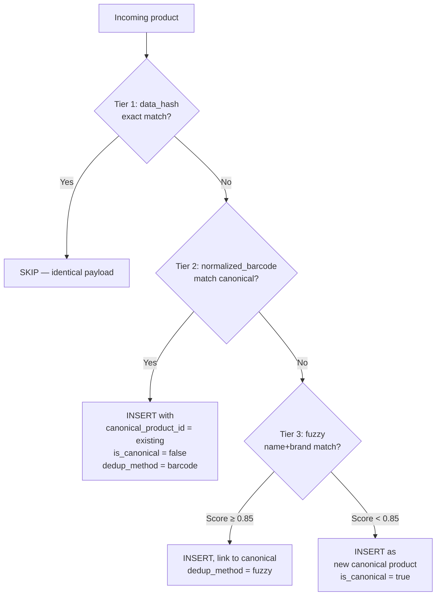

# Product Dedup: Category and Implementation Strategy

---

## Overview

**Strategy:** "Accept All, Link Later" — every record is accepted (no data loss), duplicates are linked to a canonical product. Downstream queries filter by `WHERE is_canonical = true`.



---

## Schema Changes

```sql
ALTER TABLE silver.products ADD COLUMN normalized_barcode TEXT;
ALTER TABLE silver.products ADD COLUMN canonical_product_id UUID REFERENCES silver.products(id);
ALTER TABLE silver.products ADD COLUMN is_canonical BOOLEAN DEFAULT true;
ALTER TABLE silver.products ADD COLUMN dedup_method TEXT;       -- 'barcode'|'fuzzy'|null
ALTER TABLE silver.products ADD COLUMN dedup_score NUMERIC(3,2); -- fuzzy confidence

CREATE UNIQUE INDEX idx_products_canonical_barcode 
    ON silver.products(normalized_barcode) 
    WHERE is_canonical = true AND normalized_barcode IS NOT NULL;

-- For Tier 3 performance
CREATE EXTENSION IF NOT EXISTS pg_trgm;
CREATE INDEX idx_products_name_trgm ON silver.products USING gin (name gin_trgm_ops);
```

---

## Tier 1: Exact Hash Match

Already exists via `data_hash` UNIQUE constraint on `bronze.raw_products`. If same payload is ingested twice, it's skipped at Bronze level. **No changes needed.**

---

## Tier 2: Normalized Barcode Match

### Barcode Normalization

Different barcode formats for the same product:

- `3017620422003` (EAN-13)
- `03017620422003` (with leading zero)
- `3017620422003` (trailing space)

All normalize to the same GTIN-13:

```python
def _normalize_barcode(barcode: str) -> str | None:
    """Normalize barcode to 13-digit GTIN format."""
    if not barcode: return None
    digits = re.sub(r'\D', '', barcode)  # strip non-digits
    if not digits: return None
    return digits.zfill(13)  # pad to GTIN-13
```

### Implementation

```python
# In payload_flattener.py, after extracting barcode:
norm = _normalize_barcode(silver_row.get("barcode"))
silver_row["normalized_barcode"] = norm

if norm:
    existing = client.schema("silver").table("products") \
        .select("id").eq("normalized_barcode", norm) \
        .eq("is_canonical", True).limit(1).execute()
    
    if existing.data:
        silver_row["canonical_product_id"] = existing.data[0]["id"]
        silver_row["is_canonical"] = False
        silver_row["dedup_method"] = "barcode"
    else:
        silver_row["is_canonical"] = True  # First canonical
```

---

## Tier 3: Fuzzy Name+Brand Matching (Detailed)

### When Does Tier 3 Fire?

Only when Tiers 1 and 2 both fail:

- Products with no barcode
- Products with different/erroneous barcode formats
- Products from different OFF snapshots with modified barcodes

### Scoring Formula

```python
def _compute_fuzzy_match_score(incoming: dict, candidate: dict) -> float:
    """
    Similarity score: 0.0 - 1.0. Threshold: >= 0.85
    """
    weights = {"name": 0.50, "brand": 0.30, "weight": 0.10, "category": 0.10}
    
    name_sim = _trigram_similarity(
        _normalize_product_name(incoming.get("name", "")),
        _normalize_product_name(candidate.get("name", ""))
    )
    brand_sim = _trigram_similarity(
        _normalize_brand(incoming.get("brand", "")),
        _normalize_brand(candidate.get("brand", ""))
    )
    weight_sim = _weight_similarity(
        incoming.get("package_weight_g"),
        candidate.get("package_weight_g")
    )
    cat_sim = 1.0 if incoming.get("category_code") == candidate.get("category_code") else 0.0
    
    return (name_sim * weights["name"] + brand_sim * weights["brand"] 
            + weight_sim * weights["weight"] + cat_sim * weights["category"])
```

### Name & Brand Normalization

```python
def _normalize_product_name(name: str) -> str:
    if not name: return ""
    name = name.lower().strip()
    name = re.sub(r'\b\d+\s*(g|kg|ml|l|oz|lb|fl\s*oz)\b', '', name)  # remove size info
    name = re.sub(r'[®™©]', '', name)    # remove trademark symbols
    name = re.sub(r'\s+', ' ', name).strip()
    return name

def _normalize_brand(brand: str) -> str:
    if not brand: return ""
    brand = brand.lower().strip()
    for suffix in [" inc", " llc", " ltd", " gmbh", " s.a.", " co."]:
        brand = brand.replace(suffix, "")
    return brand.strip()
```

### Trigram Similarity

```python
def _trigram_similarity(a: str, b: str) -> float:
    """Jaccard similarity of character trigrams."""
    if not a or not b: return 0.0
    if a == b: return 1.0
    
    def trigrams(s):
        s = f"  {s} "
        return set(s[i:i+3] for i in range(len(s)-2))
    
    tg_a, tg_b = trigrams(a), trigrams(b)
    if not tg_a or not tg_b: return 0.0
    return len(tg_a & tg_b) / len(tg_a | tg_b)
```

Or use PostgreSQL's `pg_trgm`:

```sql
SELECT id, name, brand,
       similarity(name, 'Nutella Hazelnut Spread') AS name_sim,
       similarity(brand, 'Ferrero') AS brand_sim
FROM silver.products
WHERE is_canonical = true
  AND similarity(name, 'Nutella Hazelnut Spread') > 0.3
ORDER BY name_sim DESC LIMIT 5;
```

### Weight Similarity

```python
def _weight_similarity(w1, w2) -> float:
    if w1 is None or w2 is None: return 0.5  # neutral
    if w1 == 0 or w2 == 0: return 0.0
    ratio = min(w1, w2) / max(w1, w2)
    return 1.0 if ratio >= 0.95 else 0.0  # within 5% tolerance
```

### Edge Cases

| Edge Case | Example | Score Breakdown | Result |
|---|---|---|---|
| **Same product, different size** | `"Nutella 350g"` vs `"Nutella 750g"` | Name ~1.0 (0.50), Brand ~1.0 (0.30), Weight 0.0 (0.00), Cat 1.0 (0.10) = **0.90** | ⚠️ Match (weight stripped from name) — need weight field check |
| **Same product, typo** | `"Nuttella"` vs `"Nutella"` | Name ~0.8 (0.40), Brand ~1.0 (0.30), Weight 1.0 (0.10), Cat 1.0 (0.10) = **0.90** | ✅ Match |
| **Private label vs brand** | `"Kirkland PB"` vs `"Skippy PB"` | Name low (0.15), Brand 0.0 (0.00) = **~0.25** | ✅ No match |
| **Brand variation** | `"Ferrero Nutella"` vs `"Nutella by Ferrero"` | Name high (0.40), Brand high (0.25) = **~0.75+** | ✅ Borderline |
| **No brand** | `brand: ""` vs `brand: ""` | Brand neutral (0.15), relies on name | Needs ~0.70 name sim |
| **Same name, different product** | `"Dove"` chocolate vs soap | Name 1.0 (0.50), Brand same (0.30), Cat 0.0 (0.00) = **0.80** | ✅ Below threshold (category saves it) |
| **Different language** | `"Nutella"` vs `"نوتيلا"` | Name 0.0, Brand varies | ✅ No match (acceptable) |

> [!WARNING]
> **"Same product, different size" edge case:** If weight info is stripped from the name, the name similarity becomes ~1.0. The `weight_sim` field (10% weight) may not be enough to differentiate. Consider: (a) increasing weight factor to 15-20%, or (b) adding a hard rule: if names match >0.9 but weights differ >10%, force separate canonical.

### Implementation Flow

```python
def _try_fuzzy_dedup(client, silver_row: dict) -> dict | None:
    """Tier 3: Fuzzy name+brand match against canonical products."""
    name = silver_row.get("name", "")
    if not name:
        return None
    
    # Narrow search space (same category or prefix match)
    candidates = client.schema("silver").table("products") \
        .select("id, name, brand, package_weight_g, category_code") \
        .eq("is_canonical", True) \
        .ilike("name", f"{name[:3]}%") \
        .limit(50).execute()
    
    best_match, best_score = None, 0.0
    for candidate in candidates.data:
        score = _compute_fuzzy_match_score(silver_row, candidate)
        if score > best_score:
            best_score = score
            best_match = candidate
    
    if best_score >= 0.85 and best_match:
        return {
            "canonical_product_id": best_match["id"],
            "is_canonical": False,
            "dedup_method": "fuzzy",
            "dedup_score": best_score,
        }
    return None  # New canonical product
```

### Performance: Limiting Search Space

| Option | How | Speed | Accuracy |
|---|---|---|---|
| **A: Same category** | `.eq("category_code", ...)` | Fast | May miss cross-category dupes |
| **B: pg_trgm index** | `CREATE INDEX ... USING gin (name gin_trgm_ops)` | Fast | Best |
| **C: Prefix filter** | `.ilike("name", f"{name[:3]}%")` | Medium | Good enough for fallback |

> [!NOTE]
> **Recommended:** Option B (`pg_trgm`) for production. Option C as fallback.

---

## Downstream Usage

```sql
-- Unique products only (for Gold ingestion, APIs, etc.)
SELECT * FROM silver.products WHERE is_canonical = true;

-- All variants of a product (for auditing)
SELECT * FROM silver.products WHERE canonical_product_id = '<uuid>';

-- Dedup audit: how many were caught by each tier
SELECT dedup_method, COUNT(*) FROM silver.products 
WHERE is_canonical = false GROUP BY dedup_method;
```

---

## Implementation Roadmap

| # | Task | Where |
|---|---|---|
| 1 | Schema migration (5 columns + 2 indexes + pg_trgm) | Migration file |
| 2 | Barcode normalization in flattener | `payload_flattener.py` |
| 3 | Tier 2: Canonical barcode lookup | `payload_flattener.py` |
| 4 | Tier 3: Fuzzy scoring functions | `payload_flattener.py` or `B2S core.py` |
| 5 | S2G: Only ingest `is_canonical = true` products | `S2G core.py` |
