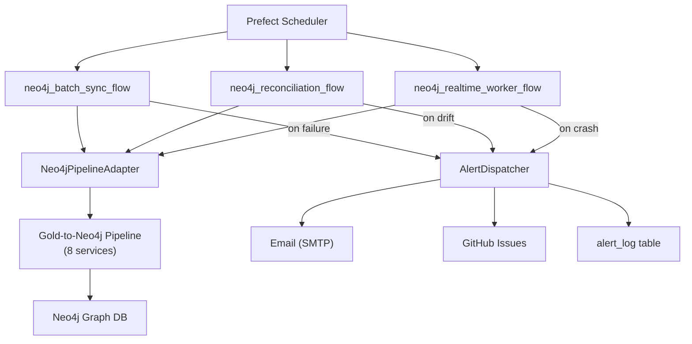

# Neo4j Integration Walkthrough

## Overview

Implemented the complete Gold→Neo4j pipeline integration into the Prefect orchestrator, including batch sync, real-time events, reconciliation, multi-channel alerting, and deployment configuration.

## Files Changed

### New Files (4)

| File | Lines | Purpose |
|------|-------|---------|
| [neo4j_adapter.py](file:///c:/Users/Sourav%20Patil/Desktop/ASM/Orchestration%20Pipeline/orchestrator/orchestrator/neo4j_adapter.py) | 316 | Wraps the Gold-to-Neo4j pipeline's 8 services via Python imports |
| [alerts.py](file:///c:/Users/Sourav%20Patil/Desktop/ASM/Orchestration%20Pipeline/orchestrator/orchestrator/alerts.py) | 320 | SMTP email + GitHub Issues alerting with dedup window |
| [test_neo4j_adapter.py](file:///c:/Users/Sourav%20Patil/Desktop/ASM/Orchestration%20Pipeline/orchestrator/tests/test_neo4j_adapter.py) | 165 | Adapter, dataclass, and JSONL parsing tests |
| [test_alerts.py](file:///c:/Users/Sourav%20Patil/Desktop/ASM/Orchestration%20Pipeline/orchestrator/tests/test_alerts.py) | 180 | Email, GitHub, dispatcher, and dedup tests |

### Modified Files (7)

| File | Changes |
|------|---------|
| [config.py](file:///c:/Users/Sourav%20Patil/Desktop/ASM/Orchestration%20Pipeline/orchestrator/orchestrator/config.py) | +22 env vars (Neo4j, SMTP, GitHub, CrewAI, drift thresholds) |
| [models.py](file:///c:/Users/Sourav%20Patil/Desktop/ASM/Orchestration%20Pipeline/orchestrator/orchestrator/models.py) | +AlertSeverity, AlertType, AlertLog, Neo4jSyncTriggerRequest |
| [db.py](file:///c:/Users/Sourav%20Patil/Desktop/ASM/Orchestration%20Pipeline/orchestrator/orchestrator/db.py) | +create_alert_log(), get_alerts() |
| [orchestration_schema.sql](file:///c:/Users/Sourav%20Patil/Desktop/ASM/Orchestration%20Pipeline/orchestrator/sql/orchestration_schema.sql) | +alert_log table, gold_to_neo4j pipeline, schedule seeds |
| [pipelines.py](file:///c:/Users/Sourav%20Patil/Desktop/ASM/Orchestration%20Pipeline/orchestrator/orchestrator/pipelines.py) | +3 tasks: batch sync, reconciliation, realtime worker |
| [flows.py](file:///c:/Users/Sourav%20Patil/Desktop/ASM/Orchestration%20Pipeline/orchestrator/orchestrator/flows.py) | +3 flows, registry updated (4→7 flows) |
| [api.py](file:///c:/Users/Sourav%20Patil/Desktop/ASM/Orchestration%20Pipeline/orchestrator/orchestrator/api.py) | +6 endpoints: Neo4j sync/status/recon, alerts, Coolify webhook, health |

### Infrastructure (2)

| File | Purpose |
|------|---------|
| [Dockerfile](file:///c:/Users/Sourav%20Patil/Desktop/ASM/Orchestration%20Pipeline/orchestrator/Dockerfile) | Production Docker image (Python 3.11-slim) with health check |
| [.env.example](file:///c:/Users/Sourav%20Patil/Desktop/ASM/Orchestration%20Pipeline/orchestrator/.env.example) | All 30+ env vars documented |

## Architecture



## Test Results

```
33 passed in 0.55s
```

All tests cover adapter dataclasses, JSONL parsing, batch sync error paths, run_all_layers stop-on-failure, email/GitHub sender config checks, dispatcher deduplication, and HTML/Markdown body builders.

## New API Endpoints

| Method | Path | Description |
|--------|------|-------------|
| POST | `/api/neo4j/sync?layer=all` | Trigger batch sync |
| GET | `/api/neo4j/sync-status` | Latest sync runs |
| GET | `/api/neo4j/reconciliation` | Latest recon results |
| GET | `/api/alerts` | List alerts (filter by severity/pipeline) |
| POST | `/webhooks/coolify` | Coolify post-deploy webhook |
| GET | `/api/pipelines/{name}/health` | Pipeline health check |

## SQL Seed Data

The schema now auto-seeds:
- **Pipeline:** `gold_to_neo4j` (gold → neo4j)
- **Schedules:** `hourly_neo4j_sync` (0 * * * *), `daily_reconciliation` (30 3 * * *)
